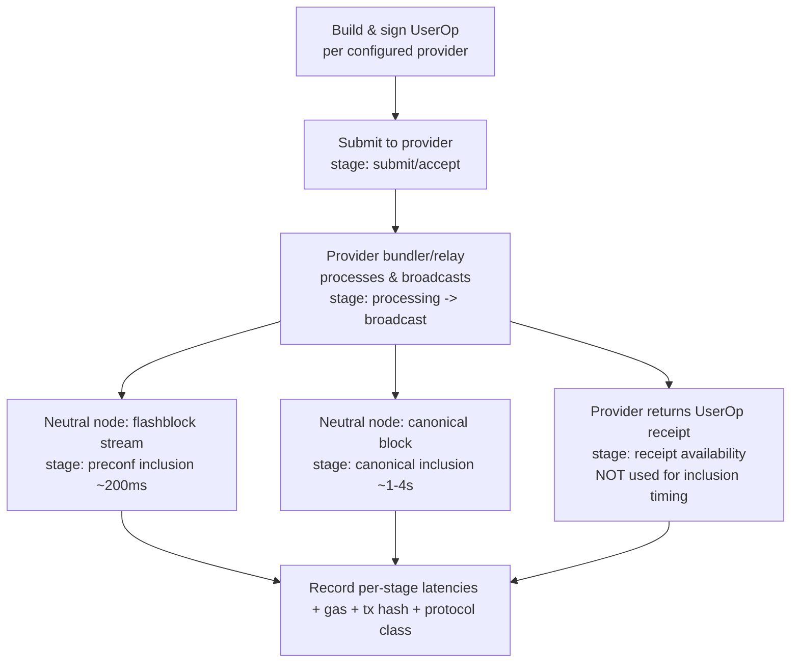

# ERC-4337 Write-Path Benchmark — Requirements

## Summary

An open-source, reproducible benchmark for the ERC-4337 write path that decomposes
latency into per-stage measurements and times each stage identically across providers,
so a skeptic can run the exact same code and get the same answer. v1 mirrors ZeroDev's
UltraRelay page 1:1 on Base mainnet (sponsored UserOp with deployment) as a direct,
honest rebuttal — while being architected so providers, networks, and write-path types
are pluggable for later generalization, and so the numbers also feed Alchemy's own
latency roadmap.

---

## Problem Frame

ZeroDev publishes a public "UltraRelay Benchmark" page that, on every run, shows Alchemy
with dramatically worse latency than UltraRelay and Pimlico. Alchemy's own internal
latency measurements do not agree, and the page's measurement logic is hidden behind a
backend call — so the distortion can be suspected but not proven. Customers weight
latency above almost everything else on the write path, so a chart that consistently
shows Alchemy as ~5–7x slower is a live competitive liability.

The page's own numbers contain the tell. From an observed run on Base mainnet:

| Provider | Send Latency (s) | Total Latency (s) | L2 Gas |
|---|---|---|---|
| Pimlico (Safe) | 0.303 | 1.461 | 425,614 |
| Alchemy (Light) | 0.243 | 5.434 | 241,031 |
| UltraRelay (Kernel) | 0.215 | 0.786 | 320,511 |

Alchemy's **send latency is tied for fastest** (0.243s), and Alchemy uses the **least
gas** of the three. The entire deficit appears *after* submission, in whatever the page
calls "Total Latency" — i.e., how it detects inclusion/confirmation. That stage is
measured client-side and per-provider, so it reflects integration and polling choices
rather than the actual write path. UltraRelay's sub-second total is also faster than a
Base canonical block (~2s), which points to it being timed to a flashblock
preconfirmation (~200ms cadence) while Alchemy is timed to full canonical inclusion — two
different finish lines compared as one.

There is a second, deeper apples-to-oranges problem: UltraRelay is not a standard ERC-4337
bundler at all but an ERC-7683 *intent relay* that submits directly to block builders and
skips the alt-mempool/bundle step entirely, so it lands in the next flashblock with no
mempool wait. A standard 4337 bundler must build and submit a bundle transaction, costing
at least one block slot. So the page compares a different protocol class, timed to a softer
finish line, against a 4337 bundler whose latency is further inflated by polling its own
receipt endpoint — three confounds stacked into one "Total Latency" column.

The remedy is a benchmark whose credibility does not depend on trusting its author: open
code, identical measurement for every provider, and a per-stage breakdown that makes the
distortion visible instead of burying it in one number.

---

## Key Decisions

- **Neutrality is the strategy, not a constraint on it.** The tool publishes fair numbers
  even where Alchemy loses a stage. A vendor benchmark that always shows the vendor
  winning is inherently suspect — the same flaw being attributed to ZeroDev. Genuine
  neutrality is the only thing that makes the tool usable as a rebuttal *and* trustworthy
  enough to drive Alchemy's own perf work.
- **No single headline metric.** The output is a full per-stage breakdown. Per-provider
  totals are derivable, but the tool does not crown a "winner" stat that could be
  collapsed and gamed. The rebuttal is "look where the time actually goes," not a
  competing single number.
- **Mirror ZeroDev's exact configuration first.** v1 replicates their published setup 1:1
  rather than normalizing it, so the latency-measurement distortion is isolated as the
  only variable and the rebuttal is "your config, your chain, measured honestly."
- **The open CLI is the source of truth; the hosted page only runs it.** Reproducibility
  by the skeptic — not a dashboard — is the credibility mechanism. The hosted surface
  must execute the same open code path with no hidden measurement logic.
- **Provider-pluggable, any subset runnable.** Someone evaluating only Alchemy can run the
  tool with just Alchemy configured. No competitor is required to use the tool.
- **Extensible by design, generalization deferred.** The provider/network/write-path
  abstractions anticipate other networks and `eth_sendRawTransaction` later, but v1 only
  builds Base 4337.
- **Two inclusion finish lines, both measured — don't pick one.** Base flashblocks are live
  on mainnet (~200ms cadence, 10 per ~2s canonical block, reorgs effectively 0%). Rather
  than arbitrate between preconfirmation and canonical inclusion, the tool times both for
  every provider as separate stages — consistent with the no-headline / full-breakdown
  decision and the most honest way to handle the flashblock ambiguity.
- **Inclusion is timed by one independent node, never the provider's own receipt.** Taking
  the inclusion stamp from a provider's own `getUserOperationReceipt`/RPC injects that
  provider's backend indexing lag into the measurement — the most likely source of the
  phantom multi-second deficit. A single neutral node, polled identically for every
  provider, removes that variance.
- **Label protocol class explicitly.** Because an intent relay (ERC-7683) and a 4337
  bundler reach different finish lines by design, the tool tags each provider's protocol
  class and shows which finish line each hits, so the comparison stays honest rather than
  reproducing ZeroDev's apples-to-oranges framing in reverse.

---

## Requirements

### Measurement & methodology

- R1. Each run is decomposed into per-stage latencies — at minimum: submit/accept,
  bundler-or-relay processing to broadcast, **flashblock preconfirmation inclusion**,
  **canonical L2 block inclusion**, and provider receipt availability — reported per
  provider. The two inclusion stages are measured separately, not collapsed.
- R2. Both inclusion stages are detected via a single neutral, provider-independent node
  applied identically to every provider:
  - Canonical inclusion: subscribe to new heads on one independent Base node and poll
    `eth_getTransactionReceipt(txHash)` on that same node; record wall-clock when non-null.
  - Flashblock preconfirmation: one flashblock-enabled subscription
    (`newFlashblockTransactions`), the same endpoint for all providers; record wall-clock
    when the hash first appears.
  - The inclusion timestamp is never taken from a provider's own
    `getUserOperationReceipt`/receipt method, which would inject that provider's backend
    indexing lag.
- R3. Each provider is tagged with its protocol class (e.g., ERC-4337 bundler vs. ERC-7683
  intent relay), and the output makes explicit which finish line each provider's headline
  timings correspond to, so different protocol classes are never silently compared at
  different finish lines.
- R4. No single headline/aggregate "winner" metric is produced. The per-stage breakdown is
  the primary output; per-provider totals are derivable but not editorialized.
- R5. Gas metrics are recorded alongside latency per provider (gas used, gas cost, L1/L2
  components), as part of an honest comparison.
- R6. Each run records the on-chain transaction hash(es) so any reported stage timing is
  independently verifiable on a block explorer.

### Fairness & configuration

- R7. v1 mirrors ZeroDev's published setup exactly: Base mainnet, sponsored UserOp
  including account deployment, a fresh smart account per provider per run, providers
  executed in parallel, and matching account types (Alchemy/Light Account, Pimlico/Safe,
  ZeroDev/Kernel).
- R8. Providers are pluggable; the tool runs with any subset configured, including a single
  provider (e.g., Alchemy alone). No provider is hard-required.
- R9. All external inputs are configuration, not hardcoded: provider API keys, funded
  wallet keys, RPC endpoints, the target network, and the neutral inclusion node(s).
- R10. Identical run parameters (gas policy, operation, account-deployment inclusion,
  concurrency) are applied across all configured providers within a run; any unavoidable
  deviation is surfaced in the output.

### Reproducibility & distribution

- R11. The primary artifact is an open-source CLI that anyone can clone and run with their
  own keys and funded wallet to reproduce published numbers.
- R12. The hosted page runs the same open CLI code path — no separate or hidden measurement
  logic — to display Alchemy-published results, and links to the repository and run
  instructions.
- R13. Output is both machine-readable and human-readable and captures the configuration,
  per-stage results, transaction hashes, and run environment, so any run is self-describing
  and auditable.

### Extensibility

- R14. The provider, network, and write-path-type abstractions are designed so additional
  networks and `eth_sendRawTransaction`/generic write paths can be added later without
  reworking the measurement core.
- R15. The stage-measurement layer is designed to accommodate a future "distortion-detector"
  mode — running a provider's own polling method alongside the neutral node — without a
  redesign.

---

## Key Flows

The measured stages and the role of the neutral oracle:

- F1. Full mirror run.
  - **Trigger:** Runner invokes the CLI with multiple providers configured (mirroring
    ZeroDev's setup).
  - **Steps:** For each provider in parallel, deploy a fresh smart account and send one
    sponsored UserOp; time submit/accept and receipt availability from the provider path;
    time both preconfirmation and canonical inclusion from the neutral node; capture gas,
    tx hash, and protocol class.
  - **Outcome:** A per-provider, per-stage breakdown plus tx hashes, with no single
    declared winner.
  - **Covered by:** R1, R2, R3, R5, R6, R7, R10.

- F2. Single-provider run.
  - **Trigger:** Runner configures only one provider (e.g., Alchemy) and runs the CLI.
  - **Steps:** Same measurement path, executed for the one configured provider; no error
    or degraded output due to absent competitors.
  - **Outcome:** A complete per-stage breakdown for the single provider.
  - **Covered by:** R8, R9.

---

## Acceptance Examples

- AE1. Single provider configured.
  - **Covers R8, R9.**
  - **Given** only Alchemy is configured (key + funded wallet + RPC),
  - **When** the runner executes the benchmark,
  - **Then** the tool produces a full per-stage breakdown for Alchemy alone and does not
    require, prompt for, or error on missing competitors.

- AE2. Inclusion measured by the neutral node.
  - **Covers R2, R3.**
  - **Given** multiple providers of different protocol classes are configured,
  - **When** inclusion latency is computed,
  - **Then** both the preconfirmation and canonical inclusion timestamps for every provider
    come from the same independent node with identical detection — not from any provider's
    own receipt method — and each provider's protocol class and finish line are labeled.

- AE3. Misconfiguration is explicit.
  - **Covers R9.**
  - **Given** a provider is enabled but its key or wallet is missing,
  - **When** the runner executes the benchmark,
  - **Then** the tool fails with a clear configuration error rather than silently skipping
    or producing misleading results.

---

## Success Criteria

- A skeptical evaluator can clone the repo, supply their own keys/wallet, and reproduce
  the published per-stage numbers within run-to-run tolerance.
- The submit/accept-stage parity between Alchemy and competitors is visible in the output,
  making the rebuttal self-evident.
- Numbers are reported honestly even when Alchemy loses a given stage.
- Every reported timing is auditable via recorded transaction hashes on a block explorer.
- Adding a new provider or network later does not require changes to the measurement core.

---

## Scope Boundaries

### Deferred for later

- Support for networks beyond Base.
- `eth_sendRawTransaction` and other generic (non-4337) write paths.
- Normalized-equivalence configurations (equal account complexity across providers).
- The "distortion-detector" mode (provider polling method vs. neutral oracle, side by side).
- Hosted-page deployment — iterate locally until the tool is ready to publish.

### Outside this product's identity

- A leaderboard that crowns a single "fastest provider" headline number.
- A closed or hosted-only benchmark whose measurement logic can't be independently run.
- Provider-favoring defaults or any configuration that advantages Alchemy.

---

## Dependencies / Assumptions

- **Publishing home:** the `alchemyplatform` public GitHub org hosts public repos and is
  the eventual home for this tool, which resolves the org policy tension around private
  repos and publicly-exposed apps. Iterate locally until then.
- **Runner-supplied resources:** serious evaluators are expected to obtain their own
  provider API keys and fund their own wallets; this friction is acceptable for v1.
- **Mainnet target:** v1 runs on Base mainnet to mirror ZeroDev; network is configuration,
  so testnet support falls out of configurability later.
- **Neutral inclusion node:** the tool needs an independent Base node for inclusion
  detection that is not one of the benchmarked providers (default: a public non-contestant
  endpoint such as `publicnode`), used identically for every provider. A flashblock-enabled
  subscription is needed for the preconfirmation stage; the canonical stage works on any
  conformant Base node. The node is configurable (R9) so a skeptic can substitute their own.
- **Base flashblock maturity:** flashblocks are live on Base mainnet (~200ms cadence, 10 per
  ~2s canonical block) with tail-flashblock reorgs effectively eliminated; preconfirmation
  timings are therefore stable enough to report, but canonical inclusion remains the
  apples-to-apples metric for two 4337 bundlers.

---

## Sources / Research

- ZeroDev UltraRelay benchmark page: `https://ultra-relay-demo.zerodev.app/`
- Base Flashblocks deep dive: `https://blog.base.dev/flashblocks-deep-dive`
- Base Flashblocks API quickstart (Alchemy docs): `https://www.alchemy.com/docs/reference/base-flashblocks-api-quickstart`
- Optimism flashblocks / preconfirmation finality model: `https://www.optimism.io/blog/flashblocks-deep-dive-250ms-preconfirmations-on-op-mainnet`
- Alchemy Wallet APIs quickstart (v1 provider integration): `https://www.alchemy.com/docs/wallets/quickstart`

---

## Outstanding Questions

### Resolve before planning

None — the inclusion finish-point definition (measure both preconfirmation and canonical
stages) and the neutral-node approach are settled in Key Decisions and R1–R3.

### Deferred to planning

- Concrete stage instrumentation points and the exact output schema.
- Whether the hosted page re-runs the benchmark live or displays periodically published runs.
- Default choice and documentation of the specific public neutral node, and how runners are
  guided to verify or substitute it.
