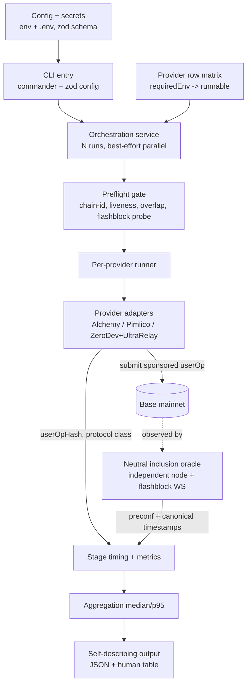
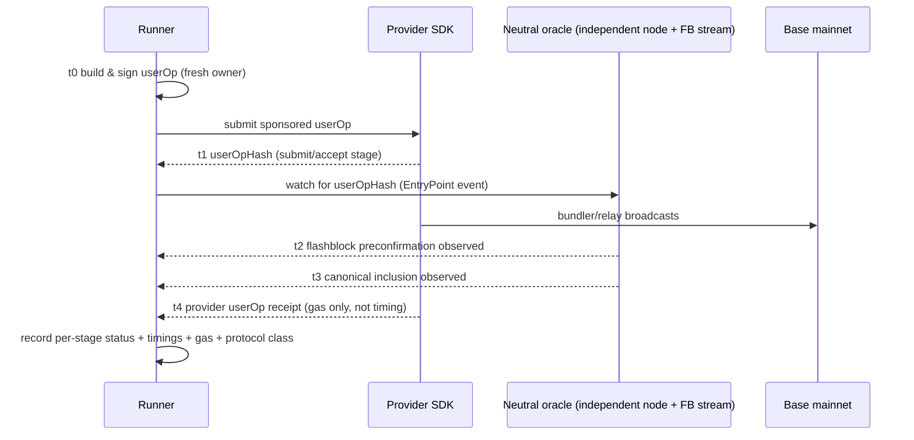

# feat: ERC-4337 write-path benchmark (v1 — Base mainnet, neutral oracle)

## Summary

Build a Bun + TypeScript CLI that benchmarks the ERC-4337 write path across providers on Base mainnet by sending sponsored UserOperations and timing each stage identically for every provider. It adopts the module shape of the colleague reference benchmark (`config → provider rows → runner → metrics → orchestration`) and generalizes its Alchemy-only row matrix into pluggable provider cells, while diverging at the one place that matters for neutrality: a **neutral inclusion oracle** (independent node + flashblock stream) replaces provider-receipt timing. v1 mirrors ZeroDev's UltraRelay page config and runs with any subset of providers.

---

## Problem Frame

ZeroDev's public UltraRelay benchmark consistently shows Alchemy ~5–7x slower on "Total Latency" while Alchemy's send latency is tied-fastest and its gas is lowest — a discrepancy the brainstorm traced to the inclusion-detection mechanism: their "total" is measured client-side, per-provider, via hidden polling, and compares an ERC-7683 intent relay timed to a flashblock preconfirmation against a 4337 bundler timed to canonical inclusion through a slow receipt poll (see origin: `docs/brainstorms/2026-06-05-erc4337-write-path-benchmark-requirements.md`).

The colleague reference (`jakehobbs/aa-benchmark-2026`) already proves out the harness shape — a UI-agnostic `benchmark/` core (config, rows, liveRunner, metrics, service) with best-effort-per-row parallel execution and a `preparing→accepted→confirming→confirmed→failed` lifecycle — but it is Alchemy-only and, critically, times confirmation by polling Alchemy's own receipt (`refreshRow`). That receipt-based timing is exactly what this tool must not do. The plan reuses the proven structure and replaces the timing path with a neutral, provider-independent oracle so the numbers survive the "you built it so you'd win" challenge.

---

## Key Technical Decisions

- **Stack and architecture: Bun + TypeScript + viem, generalizing the reference benchmark core.** Adopt the reference module layout and best-effort-per-row orchestration, but parameterize rows by provider (not Alchemy variant). viem ≥ 2.18 ships native AA primitives (`createBundlerClient`, `sendUserOperation`, `waitForUserOperationReceipt`, `entryPoint07Address`) that all three provider SDKs re-base on, so the per-provider surface is small and the harness/oracle/reporting are shared. Bun supports both the CLI and a later thin server, matching the reference.

- **The neutral inclusion oracle is the core divergence from the reference.** Inclusion is timed by provider-independent endpoints applied identically to every provider — never a provider's own `getUserOperationReceipt`. These are **two distinct endpoints**, both configured and both subject to the neutrality guard: a canonical RPC node (watched via `newHeads` + `getTransactionReceipt`/`waitForTransactionReceipt`) and a flashblock-capable WS endpoint (`eth_subscribe("newFlashblockTransactions", true)`). The flashblock transport is operationally separate and, in practice, may only be available from a contestant; if no non-contestant flashblock endpoint exists, the preconfirmation stage is reported as `contestant-sourced` (non-neutral) or `unavailable` — never silently attributed — and the canonical stage remains fully neutral. The neutral flashblock endpoint choice is a resolve-before-building item (Covers origin R2).

- **Inclusion is attributed by UserOperation identity, not bundle-tx receipt — with an explicit intent-relay branch.** For 4337 providers, match the `UserOperationEvent(userOpHash)` (indexed) emitted by the EntryPoint on the neutral node; multiple userOps share one bundle tx, so a bundle receipt alone cannot attribute timing. The ERC-7683 intent path (UltraRelay) **does not go through the EntryPoint**, so the identity layer has two branches: the intent branch must define, up front, what on-chain artifact identifies an UltraRelay fill (e.g., an ERC-7683 settlement/`Fill` event with the order hash as an indexed topic) and how the runner watches the neutral node for it. If no neutral-node-observable identity can be established for the intent path, that cell reports `inclusion not neutrally attributable` (preconf-only or excluded) rather than silently producing a number. This corrects origin R2's "poll `eth_getTransactionReceipt(txHash)`" phrasing. Learning *which* identity to watch may come from the provider, but that lookup is excluded from any timed stage.

- **Alchemy mirror path = classic Light Account (Account Kit generation A).** To stay apples-to-apples with ZeroDev's "Alchemy: Light Account" row, target `@account-kit/smart-contracts` `createLightAccountClient` + `@account-kit/infra` gas manager `policyId`. Alchemy's newer `@alchemy/wallet-apis` / EIP-7702 surface (what the reference uses) measures a different write path (no CREATE2 deploy) and is modeled as an optional separate, clearly-labeled cell — never averaged with the deploy path.

- **UltraRelay is a cell toggle in code, but a separate exhibit in output.** ZeroDev's UltraRelay is selected by appending `?provider=ULTRA_RELAY` to the ZeroDev RPC URL passed as `bundlerTransport` in the same `createKernelAccountClient` flow — hold account/client construction constant and toggle only the endpoint. But because UltraRelay is a different protocol class (ERC-7683 intent relay) that skips the bundle step by design, its results render in a **separate output exhibit**, never in the same-class headline table. The headline comparison is same-class only (Alchemy/Light, Pimlico/Safe, ZeroDev's standard Kernel bundler); UltraRelay is framed as "faster by protocol design, not by measurement" so a decontextualized screenshot of the headline can't be turned against the rebuttal. Its intent-relay timing/hash semantics on Base mainnet are an execution-time unknown to verify empirically before trusting numbers.

- **Best-effort-per-provider with explicit per-stage status.** Adopt the reference's per-row try/catch isolation. Every stage carries `ok | failed | timed-out | not-observed` plus a reason, so a flaky competitor cannot abort the run or contaminate other providers, and a failure is auditable rather than a misleading zero (Covers R18).

- **N runs with median/p95, no headline.** A single live-mainnet sample is not a defensible published number. Run each provider N times (configurable) and report per-stage median and p95. Consistent with the brainstorm's no-headline decision — per-provider totals remain derivable, but nothing is editorialized (Covers R16, origin R3).

- **Block-position is the primary finish-line metric; wall-clock is a tiebreaker.** The headline inclusion comparison is expressed by on-chain position — which (flash)block index/number each provider's userOp identity first appears in — because that is immune to runner-side transit skew and independently verifiable on a block explorer (the auditability goal). Runner wall-clock (`performance.now()` for local stages; socket-receipt time for oracle events) is recorded as a secondary, intra-block tiebreaker only. To avoid the per-channel transit skew that would otherwise reappear at flashblock (~200ms) resolution, all providers are observed over a **single shared** oracle subscription, demultiplexed by identity in the runner, rather than a socket per provider; recorded per-channel arrival jitter bounds any residual wall-clock claim. This directly addresses the risk that the design moves the distortion from provider receipt-lag to runner-side channel skew.
- **Gas sourcing for neutrality.** Canonical receipt/gas read from the neutral node where possible; userOp-level `actualGasUsed`/`actualGasCost` (only available from a bundler's userOp receipt) are clearly labeled as provider-sourced, since they are not timing measurements. Deployment gas and account type are shown adjacent to every provider timing so account-weight differences (a mirror-config confound) are never misread as provider speed.

- **Sponsored v1 needs no funded wallet.** Fully-sponsored UserOps with a throwaway generated owner key require no funding (the reference does exactly this). The brainstorm's "funded wallet" assumption applies only to a future unsponsored / `eth_sendRawTransaction` path. Secrets (API keys, any private key) come only from env per org policy; ship `.env.example` placeholders.

- **Preflight gate is terminal before any timed run.** Validate chain-ID agreement across all provider RPCs and the neutral node, probe key/policy liveness, refuse a neutral node that overlaps a benchmarked provider, and probe flashblock capability (graceful canonical-only downgrade if absent). All config/auth failures resolve before the timed window so they never pollute a stage (Covers R17).

- **Pin versions; record resolved versions in output.** The AA SDK ecosystem churns (Alchemy gen A vs B naming, permissionless 0.1→0.2, flashblock topic schema in flux). Pin every dependency and emit resolved versions + lockfile hash in the run record for reproducibility.

- **CLI-first; hosted dashboard deferred.** v1 ships the open CLI as the source of truth; the thin hosted page (brainstorm) is follow-up work.

---

## High-Level Technical Design

Component topology — the shared core with pluggable provider adapters and the neutral oracle as the timing authority:



Measurement sequence for one provider run — note the oracle, not the provider, stamps inclusion:



---

## Output Structure

Greenfield layout. Per-unit `**Files:**` remain authoritative; this tree shows intended shape:

```text
write-bench/
  package.json
  tsconfig.json
  .env.example
  README.md
  LICENSE
  src/
    cli/
      index.ts            # commander entry: `run`, `doctor`/config
      render.ts           # human-readable table output
    benchmark/
      contracts.ts        # shared types: ProviderRow, StageStatus, RunRecord, Metrics
      config.ts           # zod schema, env loading, row runnability
      rows.ts             # provider row matrix (provider x sponsored-userOp cell)
      providers/
        types.ts          # ProviderAdapter interface (viem AA seam)
        alchemy.ts        # classic Light Account adapter (+ optional wallet-api cell)
        pimlico.ts        # Safe account adapter
        zerodev.ts        # Kernel adapter + UltraRelay endpoint toggle
      oracle/
        canonical.ts      # independent-node newHeads + receipt watcher
        flashblocks.ts    # raw-WS newFlashblockTransactions listener
        identity.ts       # userOpHash <-> EntryPoint event matching
      metrics.ts          # stage timing, gas normalization, per-stage status
      preflight.ts        # chain-id, liveness, overlap guard, flashblock probe
      service.ts          # orchestration: N runs, parallel, lifecycle
      aggregate.ts        # median/p95 across N runs
      output.ts           # self-describing JSON run record
      serialize.ts        # error serialization
```

---

## Requirements

Origin requirements R1–R15 (see origin doc) are carried forward in full. R2 is refined by R19 below. The following plan-level requirements add what research and flow analysis surfaced.

### Measurement core (carried + refined)

- R1. Per-stage decomposition per provider: submit/accept, processing→broadcast, flashblock preconfirmation, canonical inclusion, provider receipt availability (origin R1).
- R2. Inclusion timed by a single neutral node applied identically to all providers; never the provider's own receipt method (origin R2, refined by R19).
- R3. Protocol class tagged per provider (4337 bundler vs ERC-7683 intent relay); output states which finish line each provider's timings correspond to. Intent relays (UltraRelay) render in a separate exhibit, not in the same-class headline comparison — the headline compares only same-class 4337 bundlers (origin R3).
- R19. Inclusion is attributed by UserOperation identity — `UserOperationEvent(userOpHash)` for 4337, relay settlement tx for intent relays — not by the bundle-tx receipt alone.
- R21. Socket loss or missed flashblock during the window is detected and flagged (reconnect-and-backfill where possible); an observed preconfirmation that does not reach canonical inclusion is flagged, not reported as a clean timing.
- R22. The primary inclusion finish line per provider is expressed by on-chain position — the (flash)block index/number the userOp identity first appears in — which is skew-immune and independently verifiable on a block explorer. Runner-side wall-clock arrival is a secondary, intra-block tiebreaker only, and the output states which kind of delta it reports.

### Statistical validity & failure model

- R16. Each provider runs N times per benchmark (configurable); report per-stage median and p95. No single-sample headline (covers origin R4 — no-headline).
- R18. Every stage carries explicit status (`ok | failed | timed-out | not-observed`) and reason; provider failures are isolated (best-effort per provider) and never abort or contaminate other providers.

### Fairness, configuration & reproducibility (carried + extended)

- R4. Gas metrics recorded per provider; userOp-level gas labeled as provider-sourced, canonical receipt gas from the neutral node (origin R5). Deployment gas + account type are shown adjacent to every timing so account-weight is never read as provider speed.
- R5. On-chain transaction hash(es) recorded per run for independent verification (origin R6).
- R6. v1 mirrors ZeroDev's setup: Base mainnet, sponsored UserOp incl. deployment, fresh account per provider per run, parallel execution, matching account types (Alchemy/Light, Pimlico/Safe, ZeroDev/Kernel) (origin R7).
- R7. Providers pluggable; any subset (including Alchemy alone) runs with no provider hard-required (origin R8).
- R8. All external inputs are configuration: provider API keys + sponsorship policy IDs, optional owner/funded key, RPC endpoints, network, neutral canonical node, and neutral flashblock endpoint (origin R9).
- R9. Identical run parameters across configured providers within a run; deviations surfaced. Account-type differences (mandated by R6's mirror) are an acknowledged, surfaced confound, not "identical" (origin R10).
- R17. A preflight gate validates chain-ID agreement across all RPCs + neutral node, probes key/policy liveness, refuses a neutral node overlapping a benchmarked provider, and probes flashblock capability — all terminal before any timed run.
- R20. The run record is self-describing: tool version + git commit, lockfile hash, resolved package versions, chain ID, start block, runner region, runner→provider and runner→neutral RTTs, and per-channel arrival-jitter and neutral-node preconf-to-canonical lag diagnostics (extends origin R13).

### Distribution (carried)

- R10. Primary artifact is an open-source CLI runnable by anyone with their own keys to reproduce published numbers (origin R11).
- R11. (Deferred to follow-up) A thin hosted page runs the same core code (origin R12; see Scope Boundaries).
- R12. Output is machine-readable (JSON) and human-readable, capturing config, per-stage results, hashes, environment (origin R13, extended by R20).
- R13. Output is self-describing and auditable (origin R13).

### Extensibility (carried)

- R14. Provider/network/write-path abstractions allow adding networks and `eth_sendRawTransaction`/generic write paths later without reworking the measurement core (origin R14).
- R15. The stage-measurement layer accommodates a future distortion-detector mode without redesign (origin R15).

---

## Implementation Units

### Phase 0 — Premise validation (gates the build)

### U11. Receipt-lag premise spike

- **Goal:** Falsify-or-confirm the load-bearing premise before building the full harness — that provider receipt-polling lag is the dominant term in ZeroDev's phantom multi-second gap.
- **Requirements:** gates R2, R6 (validates the diagnosis the whole tool rests on).
- **Dependencies:** none (runs first; minimal scaffold only).
- **Files:** `scripts/premise-spike.ts`.
- **Approach:** Send one sponsored Alchemy userOp on Base mainnet and simultaneously record (a) Alchemy's own `getUserOperationReceipt` arrival time and (b) the neutral node's canonical inclusion time for the same userOp identity. The delta is the receipt-polling lag in isolation. This is a minimal forward-pull of the deferred distortion-detector (R15), used purely as a go/no-go gate.
- **Patterns to follow:** the Alchemy adapter shape from U3 (minimal, throwaway).
- **Test scenarios:**
  - Multi-second delta → premise holds; proceed to Phase A.
  - Sub-second delta → the multi-second ZeroDev gap is NOT primarily receipt lag; pause and revisit the diagnosis (likely protocol-class + account-weight effects) before building — surface to the user / back to brainstorm.
  - Test expectation: this is a measurement spike, not a unit-tested feature; its output is a recorded delta + a go/no-go decision.
- **Verification:** a recorded receipt-lag figure and an explicit decision on whether the premise survived.

### Phase A — Foundation

### U1. Project scaffold, config & secrets

- **Goal:** Bun + TypeScript project with a validated, env-driven configuration layer and secret hygiene.
- **Requirements:** R8, R20 (partial), R10.
- **Dependencies:** none.
- **Files:** `package.json`, `tsconfig.json`, `bunfig.toml`, `.env.example`, `.gitignore`, `src/benchmark/config.ts`, `src/benchmark/config.test.ts`.
- **Approach:** zod schema for the merged config (per-provider blocks with API key + sponsorship policy id + RPC; separate neutral canonical RPC URL and neutral flashblock WS URL; network; run count N; per-stage timeouts). URL fields use a scheme allowlist (`https:`/`wss:` only) and reject embedded credentials; the private-key field is validated as `/^0x[0-9a-fA-F]{64}$/`. Secrets only from env (`Bun.env`/`process.env`); `.env.example` carries only approved placeholder tokens, never real values. Pin all dependency versions. Mirror the reference's `EnvSource` + `isEnvConfigured` shape.
- **Patterns to follow:** reference `src/benchmark/config.ts` (env presence + runnability), `.env.example` template.
- **Test scenarios:**
  - Valid full config parses into typed config object.
  - Missing required field for an enabled provider → typed validation error naming the field (no throw deep in run).
  - Malformed private key (not 32-byte hex) or URL with a non-allowlisted scheme / embedded credentials → fail fast with clear message.
  - `.env.example` guard: every value equals an approved placeholder token (e.g., `YOUR_ALCHEMY_API_KEY`, `YOUR_POLICY_ID`, `YOUR_PRIVATE_KEY`) or a URL template containing only such tokens; any other value fails.
  - Test expectation: covers happy path + config edge/error paths.
- **Verification:** `bun test` passes; running with an empty env yields a clear, actionable config error rather than a stack trace.

### U2. Provider abstraction & row matrix

- **Goal:** Define the provider adapter interface and a row matrix where each cell declares its required env and computes runnability.
- **Requirements:** R7, R8, R14, R3.
- **Dependencies:** U1.
- **Files:** `src/benchmark/contracts.ts`, `src/benchmark/rows.ts`, `src/benchmark/providers/types.ts`, `src/benchmark/rows.test.ts`.
- **Approach:** Generalize the reference `rows.ts` from Alchemy variants to provider cells. `ProviderAdapter` interface over the viem AA seam: `buildAccountClient(config) → { sendSponsored(): Promise<{ userOpHash, protocolClass, submitMs, ... }> }`. Each row declares `requiredEnv`, `protocolClass` (`4337-bundler` | `intent-relay`), and account type label. Runnability computed from present env (any subset runs).
- **Patterns to follow:** reference `src/benchmark/rows.ts`, `config.ts` runnability computation.
- **Test scenarios:**
  - With only Alchemy env present, only Alchemy rows are runnable; competitor rows reported non-runnable with missing-requirement names. Covers AE1 (origin).
  - Full env → all rows runnable.
  - Unknown row id requested → clear error.
  - Each row exposes a protocol-class tag.
- **Verification:** selecting any subset returns a coherent runnable set; no provider is structurally required.

### Phase B — Provider adapters

### U3. Alchemy adapter (classic Light Account mirror path)

- **Goal:** Send a sponsored UserOp (incl. deployment) via classic Light Account and return the userOp hash + submit timing + protocol class.
- **Requirements:** R6, R7, R19 (produces the identity the oracle watches).
- **Dependencies:** U2.
- **Files:** `src/benchmark/providers/alchemy.ts`, `src/benchmark/providers/alchemy.test.ts`.
- **Approach:** `@account-kit/smart-contracts` `createLightAccountClient` + `@account-kit/infra` gas manager `policyId`; fresh generated owner per run (no funding). Explicit two-step send (`sendUserOperation` → userOp hash) so submit/accept timing is isolated from inclusion. Optionally expose an EIP-7702 / wallet-api cell behind a flag (labeled distinct path), not the default. Verify Account Kit generation A vs B at implementation time (execution-time unknown — see Risks).
- **Patterns to follow:** reference `liveRunner.ts` `executeWalletRow`/`makeSmartAccount` (account construction + sponsorship wiring), but use the classic Light Account client for the mirror path.
- **Test scenarios:**
  - Adapter builds a client and returns a userOp hash + protocol class `4337-bundler` (mock the SDK transport; assert the timed submit stage is recorded and the inclusion lookup is NOT taken from the provider).
  - Missing `ALCHEMY_POLICY_ID` → typed config error in preflight, not mid-send.
  - Fresh owner per call → distinct account address across two calls (no salt reuse).
  - Test expectation: integration-shaped with mocked SDK; real-network call is an execution-time smoke test.
- **Verification:** returns `{ userOpHash, protocolClass, submitMs }`; no inclusion timing performed in the adapter.

### U4. Pimlico (Safe) and ZeroDev (Kernel + UltraRelay) adapters

- **Goal:** Competitor adapters returning the same `{ userOpHash, protocolClass, submitMs }` shape, including the UltraRelay endpoint toggle.
- **Requirements:** R6, R7, R3, R19.
- **Dependencies:** U2.
- **Files:** `src/benchmark/providers/pimlico.ts`, `src/benchmark/providers/zerodev.ts`, `src/benchmark/providers/pimlico.test.ts`, `src/benchmark/providers/zerodev.test.ts`.
- **Approach:** Pimlico — `permissionless` 0.2.x `toSafeSmartAccount` + `createPimlicoClient` (single bundler+paymaster endpoint, `sponsorshipPolicyId` via `paymasterContext`), explicit `sendUserOperation`. ZeroDev — `@zerodev/sdk` Kernel v3 + `createZeroDevPaymasterClient`; UltraRelay selected by appending `?provider=ULTRA_RELAY` to the ZeroDev RPC used as `bundlerTransport` — same call site, two cells (standard bundler + UltraRelay), the latter tagged `intent-relay`. Probe whether UltraRelay returns a conventional userOp hash; if not, capture the relay settlement identity for the oracle (execution-time unknown — see Risks).
- **Patterns to follow:** viem AA primitives shared with U3; entryPoint as explicit `{ address, version: "0.7" }`.
- **Test scenarios:**
  - Pimlico adapter returns userOp hash + `4337-bundler`; entryPoint passed as explicit object (guard against 0.1 API).
  - ZeroDev standard cell returns `4337-bundler`; UltraRelay cell returns `intent-relay` and differs from the standard cell only by RPC query param.
  - Each adapter generates a fresh owner per call.
  - Missing provider key/policy → typed preflight error.
  - Test expectation: integration-shaped with mocked SDK transports.
- **Verification:** all competitor cells return the common adapter shape with correct protocol-class tags.

### Phase C — Neutral measurement core

### U5. Neutral inclusion oracle (independent node + flashblock stream)

- **Goal:** Provider-independent detection of both finish lines, keyed on userOp identity, applied identically to every provider.
- **Requirements:** R2, R19, R21, R22, R3.
- **Dependencies:** U1.
- **Files:** `src/benchmark/oracle/canonical.ts`, `src/benchmark/oracle/flashblocks.ts`, `src/benchmark/oracle/identity.ts`, `src/benchmark/oracle/canonical.test.ts`, `src/benchmark/oracle/flashblocks.test.ts`, `src/benchmark/oracle/identity.test.ts`.
- **Approach:** Canonical — viem public client on the independent canonical node; `watchBlocks`/`waitForTransactionReceipt` or a controlled `getTransactionReceipt` poll loop. Flashblocks — raw `ws` JSON-RPC `eth_subscribe("newFlashblockTransactions", true)` (no first-class viem support) on the separately-configured flashblock endpoint. **Primary finish-line value is on-chain position** (the (flash)block index/number the identity first appears in), recorded per provider; wall-clock arrival is a secondary tiebreaker. Use a **single shared subscription** demultiplexed by identity in the runner (not a socket per provider) to eliminate per-channel transit skew. Identity — two branches: `UserOperationEvent(userOpHash)` from the EntryPoint for 4337; for the intent-relay path, the ERC-7683 settlement/`Fill` identity (or `inclusion not neutrally attributable` if none is observable). Integrity: cross-validate a reported inclusion (block number + tx hash) against a second read before recording it as final, so a misconfigured/malicious node can't inject fabricated timestamps. Diagnostics: record the neutral node's own preconf-to-canonical lag and per-channel arrival jitter (R20) so absolute preconf gaps are understood as node-peering-dependent. Detect socket loss → reconnect-and-backfill via range query, flag if not backfillable; flag a preconf that doesn't reach canonical.
- **Patterns to follow:** viem public client / `watchBlocks` / `waitForTransactionReceipt`; new module (no reference precedent — this is the divergence).
- **Test scenarios:**
  - Given a userOpHash and a mock EntryPoint event in a block, canonical stage records an inclusion timestamp. Covers AE2 (origin).
  - Preconf observed then canonical observed → both timestamps recorded, both attributed to the correct provider via identity match.
  - Preconf observed but canonical times out → preconf recorded, canonical `timed-out`, run flagged.
  - Canonical observed but preconf window missed → preconf `not-observed` (not "absent"), canonical `ok`.
  - Socket disconnect mid-window → reconnect + backfill recovers the event; unrecoverable gap → run flagged, not silently attributed as latency.
  - Two providers landing in the same flashblock → equal block-position, tie surfaced as the expected "finish lines differ, not providers" result (not an error).
  - Identity matcher distinguishes two concurrent userOps sharing one bundle tx; intent-relay path with no observable identity → `inclusion not neutrally attributable`.
  - Finish line is recorded as (flash)block index/number (skew-immune), with wall-clock only as intra-block tiebreaker. Covers R22.
  - Inclusion with a mismatched second-read (block/tx inconsistent) → rejected, not recorded as final (integrity guard).
  - Test expectation: integration-shaped with a mock WS server + mock node responses; this is the highest-risk unit — cover failure/timeout/reorg/integrity paths thoroughly.
- **Verification:** inclusion attribution is block-position-based and comes only from the neutral endpoints; no provider receipt is consulted for timing; all stages carry explicit present/absent/timed-out states.

### U6. Stage timing harness & metrics

- **Goal:** Assemble per-stage timings and gas metrics into a normalized per-run metrics record with explicit statuses.
- **Requirements:** R1, R4, R5, R18.
- **Dependencies:** U3, U4, U5.
- **Files:** `src/benchmark/metrics.ts`, `src/benchmark/metrics.test.ts`.
- **Approach:** Compose submit/accept (from adapter), processing→broadcast, preconf + canonical (from oracle), receipt availability into a `Metrics` record; each stage `{ ms, status, reason }`. Gas: canonical receipt gas (gasUsed, effectiveGasPrice, L1 fee, total fee) from the neutral node; userOp-level `actualGasUsed`/`actualGasCost` from the provider userOp receipt, labeled provider-sourced. Reuse the reference's numeric normalization and total-fee calculation.
- **Patterns to follow:** reference `src/benchmark/metrics.ts` (`numericToBigInt`, `calculateTotalTxFee`, `normalizeReceiptMetrics`, `mergeMetrics`).
- **Test scenarios:**
  - All stages present → complete metrics record with correct total-fee math.
  - A failed submit → submit `failed` with reason, downstream stages `not-observed`, no zero-latency masquerade. Covers R18.
  - Gas total = l2Gas * gasPrice + l1Fee; null-safe when components missing.
  - Provider-sourced gas fields tagged distinctly from neutral-node gas.
- **Verification:** a partially-failed run produces an auditable record where every stage's state is explicit.

### U7. Preflight validation gate

- **Goal:** Catch all config/auth/topology errors before the timed window.
- **Requirements:** R17, R8, R9.
- **Dependencies:** U1, U2.
- **Files:** `src/benchmark/preflight.ts`, `src/benchmark/preflight.test.ts`.
- **Approach:** For the selected runnable rows: assert chain-ID agreement across every provider RPC and both neutral endpoints; probe key/policy liveness (cheap auth call); refuse a neutral node whose URL/host overlaps a benchmarked provider (neutrality guard); probe flashblock capability on the neutral WS. If no neutral flashblock endpoint is available, set a run-level `preconf: unavailable` banner — canonical-only runs are materially different output and are not a valid rebuttal of a preconf-timed competitor claim, so they are marked distinctly rather than presented as the headline. Terminal: any hard failure aborts before timing; soft downgrades are recorded.
- **Patterns to follow:** reference `assertRowsRunnable` (extends structural validation into live preflight).
- **Test scenarios:**
  - Neutral node chain ID ≠ provider chain ID → hard error before any run (prevents silent permanent inclusion timeout). 
  - Neutral node URL == a configured provider RPC → refused with a neutrality-guard error.
  - Revoked/invalid key → preflight failure, not a polluted submit stage. Covers AE3 (origin) — misconfiguration is explicit, not silent.
  - Neutral node lacks flashblocks → canonical-only mode, flagged in output, run proceeds.
  - Test expectation: covers each guard's pass and fail.
- **Verification:** misconfiguration always fails (or downgrades) before timing; never appears as provider latency.

### Phase D — Orchestration, output & CLI

### U8. Run orchestration, N-runs & aggregation

- **Goal:** Execute N runs per provider in parallel best-effort, collect records, aggregate to median/p95.
- **Requirements:** R16, R18, R6, R9; realizes origin flows F1 (full mirror run) and F2 (single-provider run).
- **Dependencies:** U3, U4, U5, U6, U7.
- **Files:** `src/benchmark/service.ts`, `src/benchmark/aggregate.ts`, `src/benchmark/service.test.ts`, `src/benchmark/aggregate.test.ts`.
- **Approach:** Generalize the reference `service.ts` lifecycle. Run preflight; then for N iterations, execute all runnable providers in parallel with per-provider try/catch isolation; each run gets a fresh per-(provider, iteration) salt/owner so deployment parity holds and no account is reused. Aggregate per-stage median and p95 across the N successful runs per provider; carry failure counts. No aggregate cross-provider headline.
- **Patterns to follow:** reference `createBenchmarkService` (`Promise.all` per row, `applyAcceptedRow`/`applyFailedRow`, status lifecycle).
- **Test scenarios:**
  - N=3 across 2 providers → 6 runs, aggregated median/p95 per stage per provider.
  - One provider throws on every run → that provider reported as failed-with-reason; the other provider's results unaffected. Covers R18.
  - Fresh owner per (provider, iteration) → no address reuse across iterations (guards gas/deploy parity, origin R7).
  - Latency uses median/p95, not mean (right-skew); single-run input handled gracefully.
  - Test expectation: integration-shaped with mocked adapters + mock oracle.
- **Verification:** a run with a failing competitor still produces complete, honest results for the rest; output is per-stage distributional, never a single winner.

### U9. Self-describing output (JSON + human)

- **Goal:** Emit a reproducible, auditable run record and a readable summary.
- **Requirements:** R12, R13, R20, R3, R5.
- **Dependencies:** U8.
- **Files:** `src/benchmark/output.ts`, `src/benchmark/serialize.ts`, `src/cli/render.ts`, `src/benchmark/output.test.ts`.
- **Approach:** JSON record includes config used with secrets redacted (a redaction function over the typed config replaces an explicit set — API key fields, sponsorship policy IDs, private key, and any URL embedding a key as a path/query segment — with `"[REDACTED]"` before serialization), per-provider per-stage median/p95 + per-run raw timings, statuses/reasons, **block-position finish line** plus wall-clock tiebreaker, protocol class + finish-line mapping, tx/userOp hashes, gas + deployment gas + account type (with source labels), the `preconf: unavailable` banner when canonical-only, and the environment block (tool version + git commit, lockfile hash, resolved package versions, chain ID, start block, runner region as a non-sensitive slug or `local`, RTTs, per-channel jitter, neutral-node preconf-to-canonical lag). Human output: a same-class headline table (4337 bundlers only — Alchemy/Light, Pimlico/Safe, ZeroDev standard Kernel) with explicit statuses and block positions, and a separate intent-relay exhibit for UltraRelay framed as a different protocol class; never collapses to one headline number; account-weight asterisk on any cross-provider timing.
- **Patterns to follow:** reference `serialize.ts` (error serialization); reference `metrics`/contracts shape for the record.
- **Test scenarios:**
  - JSON record round-trips and contains every R20 environment field.
  - Secrets never appear in output, including API keys embedded in URL path/query segments (redaction guard asserts the raw key string is absent anywhere in the serialized JSON).
  - A timed-out/failed stage renders an explicit status in both JSON and human output (no blank/zero).
  - Protocol class, finish line, and block position shown per provider; canonical-only run carries the `preconf: unavailable` banner.
  - Test expectation: covers serialization + redaction (incl. URL-embedded keys) + failure rendering.
- **Verification:** a saved run record lets a third party reproduce and audit every number, including which finish line each provider hit.

### U10. CLI surface, reproduction docs & packaging

- **Goal:** Ship the runnable CLI and the reproduction story.
- **Requirements:** R10, R7, R17 (surfaced via a `doctor`/config command).
- **Dependencies:** U9.
- **Files:** `src/cli/index.ts`, `README.md`, `LICENSE`. (`.env.example` is created in U1; this unit may extend its placeholder list, not recreate it.)
- **Approach:** `commander` CLI with `run` (flags: providers subset, N, network, output path, `--json`) and a `doctor`/`config` command that reports which providers are runnable and runs preflight without timing (mirrors the reference's `/api/benchmark/config`). README documents bring-your-own-keys reproduction, the neutral-oracle methodology, the two finish lines, and the apples-to-oranges UltraRelay caveat — and the v1 framing limits: numbers are timing-distortion-corrected but NOT account-equivalence-corrected (account-weight confound remains, normalized mode is later), absolute preconf gaps are neutral-node-peering-dependent (only cross-provider equality is the robust claim), and runners should review the environment block before publishing a run record. Permissive OSS license; intended home is the `alchemyplatform` public GitHub org (iterate locally for now).
- **Patterns to follow:** `commander` v13; reference README structure (setup → env → run).
- **Test scenarios:**
  - `doctor` with partial env reports runnable subset and missing requirements; exits non-zero only on hard preflight failure.
  - `run` with `--providers alchemy` runs Alchemy alone end-to-end (mocked). Covers AE1 (origin).
  - `--json` emits machine-readable record to stdout/file; default emits the human table.
  - Test expectation: CLI arg parsing + subset run wiring.
- **Verification:** `bun run src/cli/index.ts doctor` and a single-provider `run` work from a clean checkout with only that provider configured.

---

## Scope Boundaries

### Deferred to Follow-Up Work

- The thin hosted page / React dashboard that runs the same core code (origin R11) — CLI-first for v1.
- Real-network end-to-end smoke runs as CI (kept manual/local initially given mainnet + paymaster policy caps).

### Deferred for later (from origin)

- Networks beyond Base; `eth_sendRawTransaction` and generic non-4337 write paths.
- Normalized-equivalence configurations (equal account complexity across providers).
- The distortion-detector mode (provider polling method vs. neutral oracle, side by side) — the oracle layer (U5) is designed to accommodate it later (R15).

### Outside this product's identity (from origin)

- A leaderboard that crowns a single "fastest provider" headline number.
- A closed or hosted-only benchmark whose measurement logic can't be independently run.
- Provider-favoring defaults or any configuration that advantages Alchemy.

---

## Risks & Dependencies

- **Alchemy Account Kit generation A vs B.** Package naming/recommended default shifted in 2026 (`@account-kit/*` classic vs `@alchemy/wallet-apis` 7702-first). v1 targets the classic Light Account deploy path for mirror fidelity; verify current package stability at implementation and pin versions. The reference uses generation B — do not copy its client construction wholesale for the mirror cell.
- **UltraRelay (ERC-7683 intent) timing semantics.** May not return a conventional userOp hash or may settle via a different tx than it submits, which affects how the oracle attributes inclusion. Verify empirically on Base mainnet before trusting UltraRelay numbers; capture its settlement identity explicitly.
- **Flashblock subscription schema in flux.** Topic string/payload (`newFlashblockTransactions`) varies across providers and is tracked in an open Base issue; no first-class viem support. Implement a thin raw-WS listener and verify the exact schema against the chosen WS endpoint; downgrade to canonical-only if unavailable.
- **Neutral node must support flashblocks for the preconf stage** and must not be one of the benchmarked providers. Default public Base nodes may be HTTP-only / canonical-only.
- **Mainnet + sponsorship.** Sponsored runs need no funded wallet, but each competitor requires its own API key + sponsorship policy configured, and paymaster policies have caps; N-runs should respect rate/cap limits.
- **Reproducibility across regions.** Absolute inclusion times vary by runner geography and RPC region; the environment block (R20) is the mitigation, and the README must frame what is structurally reproducible (stage shape, submit parity) vs. statistically reproducible (absolute times).
- **Org policy.** Repo lands in `alchemyplatform` (public) when ready; iterate locally now. Secrets only via env; `.env.example` placeholders only.

---

## Open Questions

### Resolve before building (gating)

- Run the U11 receipt-lag premise spike first. If the receipt-polling lag is not multi-second, the core diagnosis is wrong and the build should pause / return to brainstorm before Phase A.
- Is a non-contestant, flashblock-capable neutral endpoint actually available on Base mainnet? If not, the preconf stage is contestant-sourced or unavailable, which materially weakens the rebuttal — decide the stance before building U5/U7.
- What on-chain artifact identifies an UltraRelay (ERC-7683) fill on a neutral node, and can the runner watch for it? If no neutral identity exists, the UltraRelay cell is preconf-only / not-neutrally-attributable.

### Deferred to implementation

- Exact flashblock `eth_subscribe` topic string and payload schema for the chosen WS provider.
- Default N and the p95 tolerance band that defines "reproduces within tolerance."
- Default public neutral canonical node + flashblock endpoint to document in the README.
- Whether userOp-level gas (`actualGasUsed`/`actualGasCost`) is worth surfacing given it must be provider-sourced, or whether to show only neutral-node canonical gas.

---

## Sources / Research

- Origin brainstorm: `docs/brainstorms/2026-06-05-erc4337-write-path-benchmark-requirements.md`
- Reference benchmark (architecture guide): `jakehobbs/aa-benchmark-2026` — `src/benchmark/{config,rows,liveRunner,metrics,service,serialize}.ts`
- viem account-abstraction primitives: https://viem.sh/docs/clients/public · https://viem.sh/docs/actions/public/waitForTransactionReceipt
- Base Flashblocks: https://blog.base.dev/flashblocks-deep-dive · https://www.alchemy.com/docs/reference/base-flashblocks-api-quickstart · https://github.com/base/base/issues/613
- Alchemy Account Kit: https://www.alchemy.com/docs/wallets/quickstart · https://github.com/alchemyplatform/aa-sdk
- Pimlico permissionless.js: https://docs.pimlico.io/guides/how-to/accounts/use-safe-account
- ZeroDev + UltraRelay: https://docs.zerodev.app/sdk/getting-started/quickstart · https://docs.zerodev.app/blog/ultrarelay
