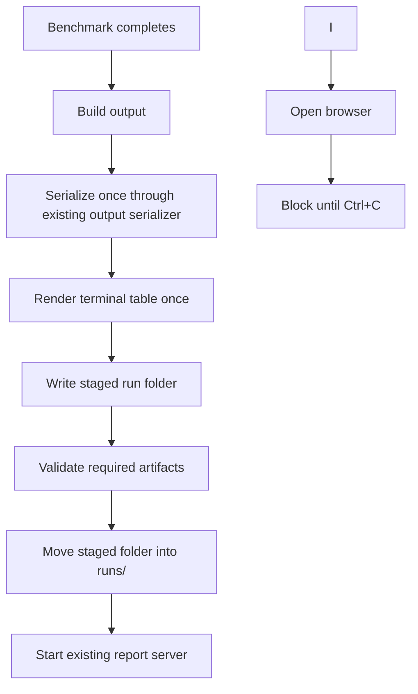

# feat: Run artifact directories and auto-open reports

## Summary

Add a small UX layer around the existing benchmark: default `run` executions persist a durable local run folder, open the existing browser report automatically, and keep serving that report until Ctrl+C. The implementation preserves the CLI as the source of truth, keeps all-configured-provider execution as the default, and extends `view` into the replay path for latest runs, run folders, and legacy JSON files.

---

## Problem Frame

The benchmark core now produces useful data, and the existing browser view is already the clearest way to interpret it. The current CLI/report handoff is still awkward: default `run` does not create a durable JSON artifact, users must manually rerun `view` against a file, and a loose `results.json` does not feel like a customer-shareable evidence packet. This plan addresses that interaction gap while staying aligned with the origin document's CLI-first reproducibility stance.

---

## Requirements

- R1. A default `run` continues to benchmark all configured/runnable providers without introducing scenarios, modes, or a required provider subset.
- R2. A successful default `run` writes a new local run folder under `runs/` using a timestamped `run-YYYY-MM-DD-HHMMSS` style name and never overwrites an existing run.
- R3. Each run folder contains the canonical serialized benchmark JSON plus small companion artifacts that make the run understandable from the filesystem.
- R4. After a successful persisted run, the CLI opens the existing browser report and keeps serving it until Ctrl+C.
- R5. `view` can reopen sample data, `latest`, a run folder, or a standalone legacy JSON file.
- R6. Machine-readable JSON stdout remains parseable and does not get mixed with browser/server/status text.
- R7. Setup/preflight failures do not create run folders, update `latest`, or open the report; completed benchmark outputs with provider-level failures remain persistable evidence.
- R8. README/help text reflects the new run-folder default.
- R9. Ignore rules keep generated local run folders out of source control by default.

**Origin actors:** benchmark runner, skeptical customer/prospect, sales/marketing reader, benchmark implementer.
**Origin flows:** F1 Full mirror run; F2 Single-provider run.
**Origin acceptance examples:** AE1 Single provider configured; AE2 Inclusion measured by the neutral node; AE3 Misconfiguration is explicit.

---

## Scope Boundaries

- No scenarios/modes/recipes in this increment; `run` continues to mean all configured/runnable providers unless `--providers` narrows it.
- No public hosted runner or publish workflow.
- No standalone offline static report bundle that can be opened without the repo/tool installed.
- No account-equivalence correction or new benchmark methodology work.
- No redesign of the existing browser UI beyond source/run metadata needed for the new artifact flow.
- No replacement of the current sample-dashboard behavior for no-argument `view`.

### Deferred to Follow-Up Work

- Fully self-contained portable report folders with copied static assets or generated `report.html`.
- Public/hosted immutable share links.
- Scenario recipes, equivalence contracts, and sales-safe no-leaderboard report modes from the ideation pass.

---

## Context & Research

### Relevant Code and Patterns

- `src/cli/index.ts` owns `doctor`, `run`, `view`, the local dashboard server, file-based dashboard payload loading, and current run output wiring.
- `src/benchmark/output.ts` owns `buildOutput()` and `serializeOutput()`; all persisted benchmark JSON should continue through this path so BigInt serialization and secret redaction remain centralized.
- `src/cli/render.ts` owns the human-readable table; any `table.txt` artifact should be generated from the same string printed to the terminal.
- `src/benchmark/rows.ts` already exposes row definitions and runnable-provider helpers; provider selection should validate requested IDs instead of silently filtering typos away.
- `web/app.js` and the static files in `web/` already render a run JSON served from `/results.json`; the plan should reuse this report rather than building a second report surface.
- Existing tests are colocated `*.test.ts` files using `bun:test`, small helpers, and dependency injection. There are currently no CLI tests, so extracting pure helpers is preferable to testing the long-lived command process directly.

### Institutional Learnings

- Keep the JSON run record as the canonical artifact; generated or served report views are derived from it and should not become a second source of truth.
- Preserve the existing BigInt-safe serialization path; do not introduce raw `JSON.stringify(output)` in new persistence code.
- Separate stable machine identifiers from display labels and filesystem-friendly aliases so run lookup and provider grouping do not drift when labels change.
- Fail fast and safely for customer-runnable setup; never print secrets while improving diagnostics.
- Update docs alongside CLI behavior so reference material does not drift from the artifact contract.

### External References

- No new external research was needed. Local CLI, output, and static-report patterns are sufficient for this UX increment.

---

## Key Technical Decisions

- **Data-self-contained run folder first.** A run folder should contain canonical benchmark data and lightweight metadata/table artifacts, but it should not copy the full web app yet. This preserves the current local-server architecture and avoids building a second static report pipeline.
- **Canonical JSON filename: `run.json`.** `view <run-folder>` resolves to this file. Standalone legacy JSON files remain accepted as direct file arguments so existing `results.json` flows keep working.
- **`latest` by discovery, not pointer state.** `view latest` resolves the newest valid finalized `runs/run-*/run.json` folder by timestamped name. This avoids a second source of truth and stale-pointer failure mode.
- **Atomic-ish persistence before opening.** Build and serialize the output once, write the run folder through a temporary/staging path, then move it into place only after required files are present. Browser opening happens after persistence succeeds.
- **`run` report lifecycle matches `view`.** After a successful default run, start the existing local report server, open the browser, and block until Ctrl+C. This is the simplest path because the current report depends on a running local server.
- **Preserve machine JSON stdout.** `run --json` with no file remains a machine mode: stdout is JSON-only, the browser does not open, and status/progress text must not corrupt stdout.
- **Provider-level failures are evidence, setup failures are not.** If the benchmark grid completes and returns records with explicit failed/timed-out statuses, persist and open the report with warnings. If config, provider selection, preflight, output serialization, or persistence fails, do not create/update/open artifacts.

---

## Open Questions

### Resolved During Planning

- **Should `run` block after opening the report?** Yes. The user chose to keep serving until Ctrl+C, matching the existing `view` architecture.
- **Should no-argument `view` switch to latest?** No. Preserve sample-data behavior and require explicit `view latest` for latest run replay.
- **Should scenarios/modes be introduced now?** No. The user explicitly said all configured providers is good enough for now.

### Deferred to Implementation

- **Exact manifest field names:** The plan specifies the artifact purpose and consumers; final field names can be chosen during implementation as long as they avoid absolute-path leakage and are covered by tests.
- **Exact browser opener commands per OS:** Implementation should use the minimal Bun/stdlib process-spawn approach and test it through injection; command details are execution-time platform glue.
- **Whether to add a convenience package script for `run`:** If it is a trivial docs/ergonomics improvement, implementation may add it; otherwise keep this plan focused on CLI behavior.

---

## High-Level Technical Design

> *This illustrates the intended approach and is directional guidance for review, not implementation specification. The implementing agent should treat it as context, not code to reproduce.*

Command behavior matrix:

| Command shape | Persist run folder | Open browser | Serve/block | Output contract |
|---|---:|---:|---:|---|
| `run` | Yes | Yes | Yes, until Ctrl+C | Terminal table + persisted artifacts |
| `run --providers ...` | Yes, if selected providers are valid/runnable | Yes | Yes, until Ctrl+C | Same as default, narrowed provider set |
| `run --json` | No | No | No | JSON-only stdout |
| `run --json <file>` | No | No | No | Legacy/export JSON file and exit |
| `run --output <file>` | No | No | No | Legacy/export table file and exit |
| `view` | No | No automatic open required | Yes | Sample data, as today |
| `view latest` | No | No automatic open required | Yes | Latest persisted run |
| `view <run-folder>` | No | No automatic open required | Yes | That run folder's canonical JSON |
| `view <json-file>` | No | No automatic open required | Yes | Legacy/direct JSON file |

Run persistence flow:

---

## Implementation Units

### U1. Tighten CLI provider selection and run option validation

**Goal:** Make `run` inputs explicit and testable before adding persistence/opening behavior.

**Requirements:** R1, R6, R7

**Dependencies:** None

**Files:**
- Modify: `src/cli/index.ts`
- Test: `src/cli/index.test.ts`

**Approach:**
- Add small testable helper functions for provider selection and run count validation near the CLI command layer; avoid a new production module unless implementation needs it for clean testing.
- Validate every requested provider ID all-or-nothing: unknown IDs or known-but-not-runnable requested rows should fail before preflight and before artifact creation.
- Reuse row metadata so errors can show available IDs and missing env names without duplicating provider definitions.
- Bring `run` no-runnable-provider behavior in line with `doctor`: fail clearly and do not proceed to preflight.
- Preserve default all-runnable-provider behavior when `--providers` is omitted.
- Ensure JSON stdout mode is identifiable early so progress/status text can be routed away from stdout or suppressed.

**Patterns to follow:**
- `src/benchmark/rows.ts` row/runnability helpers.
- Existing `doctor` provider-status behavior in `src/cli/index.ts`.
- Existing Zod run-count constraints in `src/benchmark/config.ts`.

**Test scenarios:**
- Happy path: no provider option returns all runnable rows in original row order.
- Happy path: a comma-separated provider list returns exactly those runnable rows in requested/filter order defined by the helper.
- Error path: an unknown provider ID fails before preflight and reports valid provider IDs.
- Error path: a known but non-runnable requested provider fails before preflight and reports missing env names.
- Error path: no runnable providers fails before preflight and does not request artifact creation.
- Edge case: whitespace and empty comma segments are normalized without creating phantom provider IDs.
- Edge case: invalid run counts such as zero, negative numbers, decimals, `NaN`, and values above the configured maximum are rejected consistently.
- Integration: JSON stdout mode can be detected by the command layer before progress logging begins.
- Regression: explicit export modes such as `--json <file>` and `--output <file>` remain non-interactive and exit after writing their requested artifact.

**Verification:**
- `run` cannot silently drop typoed provider IDs.
- Default `run` still means all configured/runnable providers.
- CLI validation logic has focused unit coverage without starting a benchmark or local server.

---

### U2. Add run-folder persistence and latest resolution primitives

**Goal:** Create the durable local artifact contract that default runs and `view latest` can share.

**Requirements:** R2, R3, R6, R7, R9

**Dependencies:** U1

**Files:**
- Modify: `src/cli/index.ts`
- Create: `src/cli/run-artifacts.ts`
- Test: `src/cli/run-artifacts.test.ts`
- Modify: `.gitignore`

**Approach:**
- Introduce a run artifact helper responsible for naming, staging, writing, validating, finalizing, and resolving run folders.
- Default root is `runs/`; run folder names derive from the run timestamp in UTC using `run-YYYY-MM-DD-HHMMSS`, with a deterministic suffix when a collision exists.
- Required files in the finalized folder:
  - `run.json`: canonical benchmark output produced by `serializeOutput()`.
  - `table.txt`: the same human-readable table string printed to the terminal.
  - `manifest.json`: lightweight run/source metadata using run-relative paths, tool/package version, generated timestamp, and no secrets or absolute local paths.
- Implement latest discovery by scanning finalized `runs/run-*/run.json` folders and choosing the newest valid timestamped run; do not create a separate latest pointer in this increment.
- Ignore generated `runs/` artifacts by default, consistent with the existing ignored `results*.json` pattern.

**Patterns to follow:**
- `serializeOutput()` in `src/benchmark/output.ts` for JSON persistence.
- `renderTable()` in `src/cli/render.ts` as the single source for the table artifact.
- Existing no-secret redaction expectations in `src/benchmark/output.test.ts`.

**Test scenarios:**
- Happy path: a completed output writes a finalized run folder containing `run.json`, `table.txt`, and `manifest.json`.
- Happy path: `run.json` content is exactly the serialized output string supplied to the helper, not a newly stringified object.
- Happy path: `table.txt` content is exactly the rendered table string supplied to the helper.
- Happy path: `view latest` discovery finds the newest valid finalized run folder when multiple runs exist.
- Edge case: two runs with the same timestamp create distinct folder names without overwriting.
- Edge case: manifest/source metadata uses run-relative paths and does not include absolute filesystem paths.
- Error path: a failed write or validation leaves no finalized partial run discoverable as latest.
- Error path: resolving latest with no runs produces a clear no-runs error.
- Integration: `.gitignore` ignores generated run folders while keeping source fixtures and docs trackable.

**Verification:**
- A successful default run has a durable local evidence folder.
- Repeated or concurrent-ish runs do not overwrite prior artifacts.
- `latest` discovery cannot select a half-written run produced by a failed persistence path.

---

### U3. Extend dashboard input resolution for sample, latest, run folders, and legacy JSON

**Goal:** Make `view` the reliable replay command for both new run folders and existing JSON files.

**Requirements:** R3, R5

**Dependencies:** U2

**Files:**
- Modify: `src/cli/index.ts`
- Create: `src/cli/dashboard.ts`
- Test: `src/cli/dashboard.test.ts`

**Approach:**
- Keep dashboard payload resolution as small testable CLI-layer functions that understand four input shapes: no argument, `latest`, a directory, and a file.
- Preserve no-argument `view` as sample-data mode.
- Resolve `latest` through run-folder discovery.
- Resolve a directory argument only when it contains the authoritative `run.json`; reject ambiguous directories with targeted guidance.
- Preserve direct-file behavior for old `results.json` and other standalone JSON outputs.
- Add minimum CLI-side output validation before serving: parseable JSON with a top-level `results` array and enough shape to avoid obvious dashboard crashes.
- Replace the dashboard asset containment check with path-separator-safe logic so normal assets work and traversal is rejected across platforms.
- Keep served `/source.json` useful for the dashboard without persisting or exposing absolute paths in run-folder metadata.

**Patterns to follow:**
- Current `readDashboardPayload()` and `serveDashboard()` behavior in `src/cli/index.ts`.
- `web/app.js` expectation that `/results.json` is the benchmark output and `/source.json` describes the source.

**Test scenarios:**
- Happy path: no input resolves to bundled sample JSON and sample source metadata.
- Happy path: `latest` resolves to the latest run's `run.json` and source metadata names the run folder.
- Happy path: a run folder resolves to its `run.json`.
- Happy path: a standalone legacy JSON file still resolves successfully.
- Error path: a missing file reports the resolved missing path.
- Error path: a directory without `run.json` fails with guidance to pass a JSON file or valid run folder.
- Error path: invalid JSON fails before starting the server.
- Error path: JSON without a top-level `results` array fails before starting the server.
- Edge case: source metadata returned by the helper is safe for display and does not require absolute paths for run-folder sources.
- Edge case: normal dashboard assets resolve successfully and traversal attempts are rejected using platform-safe path logic.

**Verification:**
- Existing `bun run view` sample behavior still works.
- Users can reopen `latest`, a run folder, or an old JSON artifact through one `view` command family.

---

### U4. Wire default `run` persistence, auto-open, and server lifecycle

**Goal:** Make the main benchmark command complete the intended one-command experience: run, save, open, serve.

**Requirements:** R1, R2, R3, R4, R6, R7

**Dependencies:** U1, U2, U3

**Files:**
- Modify: `src/cli/index.ts`
- Create: `src/cli/open-browser.ts`
- Test: `src/cli/open-browser.test.ts`
- Test: `src/cli/index.test.ts`

**Approach:**
- Refactor `run` so oracle cleanup happens in a `finally` path before persistence/opening logic can leave resources dangling.
- After `runBenchmarkGrid()` returns and `buildOutput()` succeeds, serialize once, render once, persist the run folder, then start the existing dashboard server against that persisted run.
- Open the browser to the local dashboard URL after the server starts. Browser-open failure is a warning, not a benchmark failure; print the URL and `view` command so the user can open manually.
- Make the auto-opened `run` server block until Ctrl+C, matching the user-confirmed lifecycle and current `view` behavior.
- Preserve JSON stdout mode: `run --json` with no file writes JSON only to stdout, does not open the browser, and does not mix progress/status text into stdout.
- Preserve explicit export modes as non-interactive compatibility paths: `--json <file>` writes JSON and exits; `--output <file>` writes the table and exits. They do not auto-open or create a run folder in this increment.
- Persist completed benchmark outputs even when provider records contain failed/timed-out statuses; print a clear warning if all providers have zero successful records.
- Do not persist/open on config load errors, invalid provider selection, preflight failure, benchmark setup throw, serialization failure, or run-folder persistence failure.

**Patterns to follow:**
- Current `serveDashboard()` port fallback and Ctrl+C lifecycle in `src/cli/index.ts`.
- Current progress event reporting from `runBenchmarkGrid()` in `src/benchmark/service.ts`.
- Current table/JSON emission branches in `src/cli/index.ts`, preserving compatibility where possible.

**Test scenarios:**
- Happy path: default run persists a run folder, updates latest, starts the report server for that folder, and invokes the browser opener with the served URL.
- Happy path: `--json <file>` writes the explicit JSON file and exits without opening or serving.
- Happy path: `--output <file>` writes the explicit table file and exits without opening or serving.
- Happy path: completed results with some provider-level failures are still persisted and served.
- Error path: preflight failure creates no run folder discoverable as latest and does not open or serve the dashboard.
- Error path: persistence failure does not start the dashboard and leaves no finalized run folder discoverable as latest.
- Error path: browser opener failure prints a warning/manual URL while keeping the server lifecycle intact.
- Error path: benchmark execution throws and both oracle resources are closed.
- Edge case: `run --json` with no file returns JSON-only stdout and does not open or serve the browser report.
- Integration: progress/status output for machine JSON mode does not corrupt stdout.

**Verification:**
- `run` gives the desired one-command interactive experience for humans.
- Machine JSON mode remains usable for scripts.
- Resource cleanup and failure boundaries are explicit enough that setup failures cannot leave misleading artifacts.

---

### U5. Update docs, help text, and user-facing copy

**Goal:** Make the documented workflow match the new default interaction.

**Requirements:** R8

**Dependencies:** U2, U3, U4

**Files:**
- Modify: `README.md`
- Modify: `src/cli/index.ts`
- Modify: `package.json`
- Test: `src/cli/index.test.ts`

**Approach:**
- Update Usage examples to center the new default: `run` writes `runs/run-.../`, opens the browser report, and serves until Ctrl+C.
- Document `view latest`, `view <run-folder>`, and `view <json-file>` as the replay paths.
- Replace stale `results.json` default wording with the run-folder artifact contract.
- Preserve reproduction language around open CLI/source-of-truth and explain that the browser report is local/read-only and backed by `run.json`.
- Document JSON stdout and explicit export modes as the machine-readable/non-interactive escape hatches.
- Consider adding or updating package scripts only if they reduce friction without changing the CLI contract; any script should point to the same CLI entrypoint.

**Patterns to follow:**
- Current README's neutral-oracle and framing-limit sections.
- Existing commander descriptions/options in `src/cli/index.ts`.

**Test scenarios:**
- Happy path: CLI help snapshots or option-helper tests cover new/changed option descriptions where practical.
- Documentation check: README examples mention run folders and no longer imply a loose `results.json` is the default artifact.
- Documentation check: README preserves the local/read-only report framing and does not imply public hosting or hosted benchmark execution.
- Documentation check: machine JSON mode is explicitly documented separately from the interactive report-opening default.

**Verification:**
- A first-time user can infer the intended flow from README and command help without knowing the previous `results.json` workflow.

---

## System-Wide Impact

- **Interaction graph:** The main CLI path now crosses benchmark execution, artifact persistence, dashboard serving, and browser opening. Helpers should keep these seams isolated so output serialization and web rendering remain independently understandable.
- **Error propagation:** Config/provider/preflight/persistence errors should stop before opening; provider-level benchmark failures should flow into the run record and report rather than becoming command-level artifact failures.
- **State lifecycle risks:** Partial run folders and stale `latest` pointers are the main persistent-state risks. Staged writes and post-validation pointer updates mitigate them.
- **API surface parity:** Existing direct JSON-file viewing remains supported; no-argument `view` remains sample mode. New run-folder behavior should not remove existing dashboard import/download behavior.
- **Integration coverage:** Unit tests for helpers are necessary but not sufficient; at least one command-level integration test should prove the default run-to-report handoff uses the same persisted artifact that `view` can reopen.
- **Unchanged invariants:** Benchmark methodology, provider adapters, neutral oracle timing, run metrics, and browser visualization semantics stay unchanged except for how the existing report is launched and sourced.

---

## Risks & Dependencies

| Risk | Mitigation |
|------|------------|
| Default `run` changing from an exiting command to a blocking interactive command surprises script users | Preserve `run --json`, `run --json <file>`, and `run --output <file>` as non-interactive export modes; document the lifecycle clearly. |
| Partial artifacts make `view latest` open invalid data | Stage writes, validate required files, and only move finalized folders into the discoverable `runs/run-*` namespace. |
| Browser-opening behavior differs across macOS/Linux/Windows/headless environments | Keep opener best-effort, dependency-light, injectable in tests, and non-fatal when it fails. |
| Dashboard asset containment logic breaks on non-POSIX path separators | Use platform-safe relative-path containment checks and cover normal assets plus traversal rejection in tests. |
| New persistence path bypasses redaction or BigInt serialization | Route every persisted run through `serializeOutput()` and cover it in tests. |
| Source metadata leaks local absolute paths in shareable artifacts | Use run-relative paths in persisted manifests; keep any local-only absolute path out of run-folder metadata. |
| CLI tests become brittle if they exercise long-lived servers directly | Extract pure helpers and inject server/opener behavior in command-level tests. |

---

## Documentation / Operational Notes

- Update `.gitignore` to ignore generated `runs/` artifacts by default.
- README should describe run folders as local evidence artifacts, not as public hosted reports.
- The browser report is still local/read-only and served by the CLI; public sharing/publishing remains future work.
- If a customer wants to share a run before publish support exists, they can share the run folder or canonical `run.json`; the manifest should include the tool/package version and generated timestamp needed to interpret it.

---

## Sources & References

- **Origin document:** [docs/brainstorms/2026-06-05-erc4337-write-path-benchmark-requirements.md](../brainstorms/2026-06-05-erc4337-write-path-benchmark-requirements.md)
- Existing plan background: [docs/plans/2026-06-08-001-feat-erc4337-write-path-benchmark-plan.md](2026-06-08-001-feat-erc4337-write-path-benchmark-plan.md)
- CLI entrypoint and dashboard server: `src/cli/index.ts`
- Human table renderer: `src/cli/render.ts`
- Output serialization: `src/benchmark/output.ts`
- Provider rows and runnability: `src/benchmark/rows.ts`
- Browser report: `web/index.html`, `web/app.js`, `web/styles.css`
- User-facing docs: `README.md`
