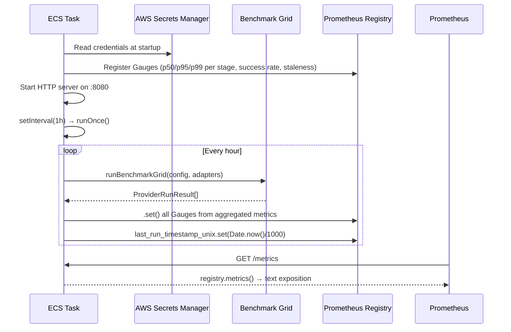
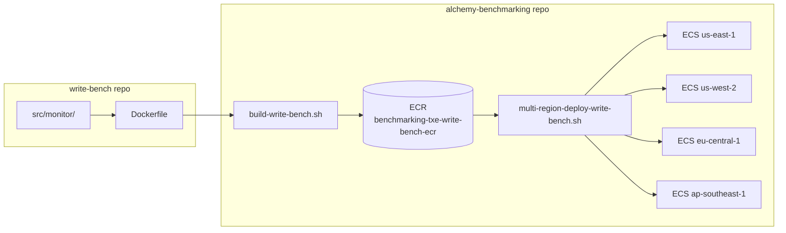

# feat: Add continuous Prometheus monitoring service

**Target repos (two-repo plan):**
- **Primary** (`docs/plans/` home): `write-bench` — monitoring entrypoint, Prometheus metrics, Dockerfile
- **Secondary**: `OMGWINNING/alchemy-benchmarking` — ECS deploy scripts, CircleCI integration

All file paths below are relative to whichever repo is indicated per unit.

---

## Summary

Wrap write-bench's existing benchmark grid in a long-running monitoring service that runs
hourly, exposes per-stage latency percentiles as Prometheus Gauges on port 8080, and
deploys as a separate ECS task alongside `rpc_slo_monitor` in alchemy-benchmarking's
existing multi-region infrastructure.

---

## Problem Frame

Write-bench produces per-stage latency numbers on demand, but no continuous record exists
of how Alchemy's write-path latency trends over time. The `rpc_slo_monitor` Java service
monitors `eth_sendRawTransaction` continuously but does not cover the smart-account paths
(ERC-4337 UserOp, `wallet_sendCalls`). A continuous monitoring service closes this gap
and feeds a Grafana dashboard for the team's regression tracking and latency roadmap work.
(see origin: `docs/brainstorms/2026-06-29-continuous-monitoring-requirements.md`)

---

## Requirements

From the origin document:

- **R1** Hourly benchmark runs across configured networks, Alchemy-only
- **R2** ERC-4337 (`4337-bundler`) and `wallet_sendCalls` (`wallet-sendcalls`) adapter coverage
- **R3** Per-stage Prometheus Gauges (p50, p95, p99) on port 8080 at `/metrics`
- **R4** `last_run_timestamp_unix` staleness sentinel per adapter × network × region
- **R5** Network selection config-driven (env var), no hardcoded network list
- **R6** Separate ECS task from `rpc_slo_monitor` (platform owner requirement)
- **R7** AWS Secrets Manager for all credentials (matches existing service pattern)
- **R8** CloudWatch log output for failures — no active alerting in v1
- **R9** Multi-region deployment via existing `multi-region-deploy-*.sh` script pattern

---

## Key Technical Decisions

**1. Long-running process with internal `setInterval` (not EventBridge cron)**
The existing `rpc_slo_monitor` is a perpetually-running ECS service that manages its own
schedule internally. The write-bench monitor follows the same pattern: one always-on ECS
service per region, `setInterval` fires the benchmark grid every hour. This avoids the
operational complexity of EventBridge Scheduled Rules and is consistent with what the
platform team already knows how to operate. Trade-off: the ECS service restart policy must
be set to `ALWAYS` so a crash triggers re-launch.

**2. `prom-client` as the Prometheus library**
Industry-standard Node.js Prometheus client. Bun supports it via its Node.js compatibility
layer (`bun:http` handles `http.createServer`). The pattern is identical to the Python
`grpc_benchmark/src/metrics.py` at the abstraction level: create a `Registry`, register
`Gauge` instances, call `.set()` after each run. One Registry per process; `/metrics`
served by a thin HTTP handler that calls `registry.metrics()`.

**3. Metric label schema uses actual code stage names, not the requirements doc names**
The requirements doc proposed adapter-specific stage names. The codebase uses a unified
set across all adapters: `prepare`, `submit`, `preconf`, `canonical`, `providerReceipt`.
The `protocol_class` label (`4337-bundler` | `wallet-sendcalls`) and `provider_id` (the
adapter's `id` field, e.g., `alchemy-light-account`) differentiate adapter types. This
eliminates sparse metrics and directly reflects the data the aggregator produces.

**4. Monitoring code lives in write-bench repo; deployment lives in alchemy-benchmarking**
The monitoring entrypoint, Prometheus metrics module, secrets loader, and Dockerfile are
co-located with the domain code they orchestrate (write-bench). The ECS task definitions,
deploy scripts, and CircleCI workflows that operate those containers live in
alchemy-benchmarking as the platform that owns ECS. This mirrors a common microservice
split: the service owns its image; the platform owns its deployment.

**5. Separate ECR repository for write-bench images**
Following the `benchmarking-rpc-slo-ecr` naming convention, a new ECR repo
`benchmarking-txe-write-bench-ecr` in account `077805585760` holds write-bench images.
This avoids tag collisions with the Java service and keeps image lifecycle independent.

**6. p99 added to `StageMetrics`**
The existing `aggregate.ts` has `median()` and `p95()`. Adding `p99()` alongside is a
minimal extension to `contracts.ts` and `aggregate.ts`. The monitoring service exposes
all three percentiles per stage per adapter.

---

## High-Level Technical Design

### Service lifecycle



### Metric label schema

| Metric | Labels |
|---|---|
| `txe_bench_stage_latency_p50_ms` | `protocol_class, provider_id, stage, network, region` |
| `txe_bench_stage_latency_p95_ms` | `protocol_class, provider_id, stage, network, region` |
| `txe_bench_stage_latency_p99_ms` | `protocol_class, provider_id, stage, network, region` |
| `txe_bench_success_rate` | `protocol_class, provider_id, network, region` |
| `txe_bench_sample_count` | `protocol_class, provider_id, network, region` |
| `txe_bench_failure_count` | `protocol_class, provider_id, network, region` |
| `txe_bench_last_run_timestamp_unix` | `protocol_class, provider_id, network, region` |

**Label values:**
- `protocol_class`: `4337-bundler` | `wallet-sendcalls`
- `provider_id`: adapter's `id` field (e.g., `alchemy-light-account`, `alchemy-wallet-sendcalls`)
- `stage`: `prepare` | `submit` | `preconf` | `canonical` | `providerReceipt`
- `network`: `NETWORK` env var value (e.g., `base-mainnet`, `eth-mainnet`)
- `region`: `AWS_REGION` env var value

### Two-repo deployment flow



---

## Output Structure

New files in write-bench repo:

```
src/monitor/
├── main.ts          # entrypoint: registry, HTTP server, run loop
├── metrics.ts       # prom-client Gauge definitions
├── metrics.test.ts
├── secrets.ts       # AWS Secrets Manager loader
├── secrets.test.ts
├── loop.ts          # hourly benchmark run → Gauge push
└── loop.test.ts
Dockerfile           # multi-stage Bun build for linux/amd64
```

New files in alchemy-benchmarking repo:

```
scripts/
├── build-write-bench.sh
├── deploy-write-bench.sh
└── multi-region-deploy-write-bench.sh
.circleci/workflows.yml   (modified — add write-bench workflows)
```

---

## Implementation Units

### U1. Extend StageMetrics with p99

**Goal:** Add `p99()` to the aggregation module and surface it in `StageMetrics` so the
monitoring layer can expose it as a Prometheus Gauge.

**Requirements:** R3 (p99 Gauge)

**Dependencies:** none

**Files** *(write-bench repo)*:
- `src/benchmark/contracts.ts` — add `p99: number` to `StageMetrics`
- `src/benchmark/aggregate.ts` — add `p99()` function; update `computeStageMetrics()`
- `src/benchmark/aggregate.test.ts` — new test cases for `p99()`

**Approach:** `p99()` follows the same pattern as the existing `p95()`: sort ascending,
index at `ceil(N * 0.99) - 1`, clamp to array bounds. `StageMetrics` gains a `p99` field
alongside `median` and `p95`. `computeStageMetrics()` returns all three. Existing callers
(CLI output, rows, aggregate) are unaffected — the field is additive.

**Patterns to follow:** `src/benchmark/aggregate.ts` — `p95()` and `computeStageMetrics()`

**Test scenarios:**
- `p99([])` returns 0 (empty array guard)
- `p99([1, 2, 3, 4, 5, 6, 7, 8, 9, 10])` returns the correct 99th-percentile index value
- `p99([42])` with a single element returns that element
- `computeStageMetrics([...values])` result includes `p99` and it matches `p99(values)` standalone
- `aggregateRuns()` — a stage with N successful records has `p99` populated in its `StageMetrics`

**Verification:** `bun test src/benchmark/aggregate.test.ts` passes; TypeScript compiles
cleanly with `tsc --noEmit`.

---

### U2. Prometheus metrics definitions

**Goal:** Define all Gauges that the monitoring service will set, with correct label
schemas, using `prom-client`.

**Requirements:** R3, R4

**Dependencies:** none (no write-bench business logic needed)

**Files** *(write-bench repo)*:
- `package.json` — add `prom-client` dependency
- `src/monitor/metrics.ts` — `buildMetrics(registry)` factory returning typed Gauge refs
- `src/monitor/metrics.test.ts`

**Approach:** `buildMetrics(registry: Registry)` registers all seven Gauges and returns a
typed `MonitorMetrics` object keyed by metric name. Label arrays match the schema in the
High-Level Technical Design section. The factory pattern matches
`grpc_benchmark/src/metrics.py:get_prometheus_metrics()`. Using a custom `Registry`
(not the default global) allows isolation in tests and avoids cross-process pollution,
matching the Java service's `CollectorRegistry` pattern.

No Histograms or Counters — hourly runs produce point-in-time Gauge values, not
streaming frequency data. (see origin: key decision "Gauge-based metrics, not Histograms")

**Patterns to follow:** `grpc_benchmark/src/metrics.py`

**Test scenarios:**
- `buildMetrics(new Registry())` registers exactly the seven expected metric names
- Each Gauge has the correct label names (assert via `registry.getSingleMetric()`)
- Calling `.set()` on a latency Gauge with label values and then `.metrics()` on the
  registry produces a text exposition line containing the expected metric name and value
- Calling `buildMetrics()` twice with different Registry instances does not throw
  (registration isolation)

**Verification:** `bun test src/monitor/metrics.test.ts` passes; `prom-client` is present
in `node_modules/`.

---

### U3. AWS Secrets Manager credentials loader

**Goal:** Load all credentials needed for a monitoring run from AWS Secrets Manager at
startup, matching the pattern used by `rpc_slo_monitor`.

**Requirements:** R7

**Dependencies:** U2 (shares the monitoring module)

**Files** *(write-bench repo)*:
- `package.json` — add `@aws-sdk/client-secrets-manager`
- `src/monitor/secrets.ts` — `loadMonitoringCredentials(region)` → typed credential object
- `src/monitor/secrets.test.ts`

**Approach:** A single ASM secret (name: `benchmarking-txe-write-bench-keys`, JSON object)
holds all credentials: `ALCHEMY_API_KEY`, `ALCHEMY_POLICY_ID`, `OWNER_PRIVATE_KEY`, and
any per-network RPC overrides. `loadMonitoringCredentials()` calls
`SecretsManagerClient.send(GetSecretValueCommand)`, parses the JSON string, validates
required fields are present, and returns a typed object. Uses the same `AWS_REGION` env
var the Java service uses. Mirrors `rpc_slo_monitor`'s `SecretReader.java` in shape.

The `NETWORK` env var (which adapter networks to run) and `RUN_COUNT` remain plain env
vars — they are deployment-time config, not credentials.

**Patterns to follow:** `rpc_slo_monitor/src/main/java/com/alchemy/benchmarking/secrets/SecretReader.java`

**Test scenarios:**
- Returns a correctly typed credential object when the mock ASM response contains a valid
  JSON string with all required keys
- Throws a descriptive error when a required key is missing from the secret JSON
- Throws when the ASM call itself fails (mock `GetSecretValueCommand` throwing)
- `OWNER_PRIVATE_KEY` in the returned object matches `0x${string}` format constraint from
  `config.ts`'s `privateKey` validator

**Verification:** `bun test src/monitor/secrets.test.ts` passes without real AWS credentials
(mock the SDK client).

---

### U4. Hourly run loop

**Goal:** Orchestrate an hourly benchmark run: load config, run the benchmark grid across
configured adapters, compute percentile aggregates, and push results to Prometheus Gauges.

**Requirements:** R1, R2, R3, R4, R5, R8

**Dependencies:** U1, U2, U3

**Files** *(write-bench repo)*:
- `src/monitor/loop.ts` — `runOnce(credentials, metrics, region)` and `startLoop()`
- `src/monitor/loop.test.ts`

**Approach:**

`runOnce(credentials, metrics, region)`:
1. Call `loadConfig()` with credentials injected as env-like object. `NETWORK` comes from
   `process.env.NETWORK` (R5 — not hardcoded). `RUN_COUNT` from `process.env.RUN_COUNT`
   (default 20 for monitoring; lower than CLI default 5 to bound per-run gas cost while
   giving statistical confidence).
2. Build the Alchemy-only adapter list from the loaded config: include adapters whose
   required env keys are present. For Alchemy-only monitoring this is `alchemy.ts` adapters
   and `alchemy-wallet-sendcalls.ts`.
3. Call `runBenchmarkGrid()` with canonical oracle (using `NEUTRAL_RPC_URL` from config)
   and no flashblock oracle (monitoring does not require preconf timing).
4. For each `ProviderRunResult`: call `aggregateRuns()` to get `ProviderMetrics`, then set
   all seven Gauges for each populated stage. Stages absent in a result (e.g., `preconf`
   when no flashblock oracle) are skipped — do not set Gauges with 0.
5. Set `txe_bench_last_run_timestamp_unix` after all Gauges are pushed.
6. Log structured JSON to stdout on success and failure (CloudWatch picks this up — R8).

`startLoop(credentials, metrics, region)`: calls `runOnce()` immediately at startup, then
`setInterval(runOnce, 60 * 60 * 1000)`. Catches and logs errors per run without crashing
the process.

**Patterns to follow:**
- `src/benchmark/service.ts` — `runBenchmarkGrid()` call convention
- `src/benchmark/aggregate.ts` — `aggregateRuns()` usage
- `rpc_slo_monitor/src/main/java/com/alchemy/benchmarking/Application.java` — scheduler
  and metrics-push pattern

**Test scenarios:**
- `runOnce()` with a mock `runBenchmarkGrid` that returns 2 providers × 3 stages each
  calls `.set()` on the correct Gauges with the correct label values
- `last_run_timestamp_unix` Gauge is set after a successful run
- A provider with `failureCount > 0` sets `txe_bench_failure_count` accurately
- A stage with no successful samples (all undefined `ms`) does not set the latency Gauges
  (no zero-inflation)
- `runOnce()` catches and logs an error thrown by `runBenchmarkGrid` without rethrowing
  (process stays alive for the next interval)
- `NETWORK` env var is passed through to `loadConfig()` (not hardcoded)

**Verification:** `bun test src/monitor/loop.test.ts` passes; a manual run with
`NETWORK=base-mainnet RUN_COUNT=3 bun run src/monitor/main.ts` reaches the benchmark grid
and sets Gauges visible at `curl http://localhost:8080/metrics`.

---

### U5. HTTP server entrypoint and Dockerfile

**Goal:** Wire the registry, HTTP metrics server, secrets loader, and run loop into a
single entrypoint; package it as a linux/amd64 Docker image.

**Requirements:** R3, R6, R9

**Dependencies:** U2, U3, U4

**Files** *(write-bench repo)*:
- `src/monitor/main.ts` — entrypoint: creates Registry, loads credentials, starts server,
  starts loop
- `Dockerfile` — multi-stage Bun build targeting linux/amd64

**Approach:**

`main.ts` startup sequence:
1. Create `prom-client` `Registry`
2. Call `buildMetrics(registry)` → `MonitorMetrics`
3. Call `loadMonitoringCredentials(region)` where `region = process.env.AWS_REGION`
4. Start HTTP server: `Bun.serve({ port: 8080, fetch })` — the fetch handler returns
   `registry.metrics()` with `Content-Type: text/plain; version=0.0.4` on `GET /metrics`,
   404 otherwise. (Use `Bun.serve` rather than Node.js `http.createServer` — it's native
   to the runtime and avoids `prom-client`'s built-in server which uses Node.js `http`.)
5. Call `startLoop(credentials, metrics, region)`

`Dockerfile` structure:
- Base: `oven/bun:1` for the build stage
- Install dependencies: `bun install --frozen-lockfile --production`
- Copy source
- Final stage: `oven/bun:1-slim`
- `EXPOSE 8080`
- `CMD ["bun", "run", "src/monitor/main.ts"]`
- Build with `--platform linux/amd64` in the build script

**Test scenarios:**
- `main.ts` integration: start the server against a mock loop, `GET /metrics` returns
  `200` with `Content-Type: text/plain; version=0.0.4`
- `GET /healthz` or any non-`/metrics` path returns `404`
- `docker build --platform linux/amd64` completes without error (manual verification)
- `docker run -e AWS_REGION=us-east-1 -e NETWORK=base-mainnet -p 8080:8080 <image>` starts
  and `curl localhost:8080/metrics` responds (manual verification, requires real ASM access
  or local credential mock)

**Verification:** Image builds and serves `/metrics`. `bun test src/monitor/` passes in its
entirety.

---

### U6. Deployment scripts and CircleCI integration

**Goal:** Add the build, deploy, and multi-region deploy scripts to alchemy-benchmarking
following the existing `rpc_slo_monitor` pattern, and wire CircleCI to auto-deploy on
merge to `main`.

**Requirements:** R6, R9

**Dependencies:** U5 (Docker image must exist)

**Files** *(OMGWINNING/alchemy-benchmarking repo)*:
- `scripts/build-write-bench.sh` — build and push to ECR `benchmarking-txe-write-bench-ecr`
- `scripts/deploy-write-bench.sh` — deploy to a single ECS service in one region
- `scripts/multi-region-deploy-write-bench.sh` — loop over prod regions; one service per
  region (no service-ID inner loop — write-bench is a single task per region)
- `.circleci/workflows.yml` — add `test-write-bench`, `deploy-write-bench-staging`, and
  `deploy-write-bench-prod` workflows with path filtering on `src/monitor/` and
  `Dockerfile` from the write-bench repo

**Approach:**

`build-write-bench.sh` mirrors `build-rpc-slo-monitor.sh`:
- ECR repo: `077805585760.dkr.ecr.us-east-1.amazonaws.com/benchmarking-txe-write-bench-ecr`
- Image tag: `$CIRCLE_SHA1` in CI, `git rev-parse --short HEAD` locally (from write-bench
  checkout path — the script accepts `--source-dir` to point at the write-bench checkout)
- `docker build --platform linux/amd64`

`multi-region-deploy-write-bench.sh` is simpler than the rpc_slo equivalent: it loops
over `$PROD_REGIONS` with a single `deploy_to_region()` call per region (no service-ID
inner loop). ECS cluster and service naming:
- Cluster: `benchmarking-cluster-${REGION}-${ENVIRONMENT}` (reuse existing)
- Service: `txe-write-bench-${REGION}-${ENVIRONMENT}`

CircleCI path filtering: trigger write-bench workflows on changes to `Dockerfile`,
`src/monitor/`, `package.json`, `bun.lock` in the write-bench source.

**Prerequisite (out of scope for this plan):** The ECR repository
`benchmarking-txe-write-bench-ecr` and the ECS service/task definition
`txe-write-bench-${REGION}-${ENVIRONMENT}` must be created in Terraform before this unit
can deploy. Coordinate with the platform team.

**Test scenarios:**
- `build-write-bench.sh --help` prints usage without error
- `build-write-bench.sh` with a missing `source-dir` exits non-zero with a descriptive
  error message
- `multi-region-deploy-write-bench.sh -e staging` iterates only `us-east-1` (staging
  region) and calls `deploy-write-bench.sh` once
- `multi-region-deploy-write-bench.sh -e prod` without a pre-built `image_tag.txt` exits
  non-zero with a clear error
- A non-ACTIVE ECS service is skipped gracefully (mirrors rpc_slo_monitor behavior)

**Verification:** Manual staging deployment succeeds: `curl` to the ECS task's Prometheus
port returns metric text. `GET /metrics` shows `txe_bench_last_run_timestamp_unix` set
within the last 65 minutes after one successful run.

---

## Scope Boundaries

### Deferred to follow-up work

- Grafana dashboard JSON — the metrics will be present in Prometheus on day one; a
  dashboard can be built incrementally once data flows.
- Slack or PagerDuty alerting on staleness — the `last_run_timestamp_unix` sentinel makes
  this addable later with one alertmanager rule.
- Competitor providers (Pimlico, ZeroDev) in the monitoring infrastructure.
- `eth_sendRawTransaction` adapter — already covered by `rpc_slo_monitor`.

### Out of scope

- Public data export or connection to the hosted benchmark page.
- Wallet balance monitoring or automatic top-up.
- Changes to the existing `rpc_slo_monitor` Java service.

---

## Risks and Dependencies

| Risk | Mitigation |
|---|---|
| `prom-client` incompatibility with Bun | Verify `prom-client` installs and `registry.metrics()` returns valid text in a Bun process; substitute `Bun.serve` for the library's built-in HTTP server |
| ETH mainnet gas costs exceed budget at `RUN_COUNT=20` | Default `RUN_COUNT` is configurable per ECS task env; start conservative (10–20) and adjust |
| Write-bench wallet runs out of funds | Operational concern; the `txe_bench_failure_count` Gauge and CloudWatch logs will surface this |
| ECR repo and ECS task definition don't exist yet | Must be created in Terraform before U6 deploys; coordinate with platform team early |
| `alchemy-wallet-sendcalls.ts` generates a fresh ephemeral key per `buildAccountClient()` | Acceptable for monitoring (each hourly run uses a fresh key); wallet must be funded per-run or use a gas-sponsored policy that covers fresh accounts |

---

## Open Questions

- **Which Alchemy adapter variants to monitor?** The codebase has `alchemy.ts`,
  `alchemy-mav2.ts`, `alchemy-mav2-bso.ts`, and `alchemy-wallet-sendcalls.ts`. The
  monitoring loop can run all that are configured, but the operator should decide which
  `ALCHEMY_POLICY_ID` values to configure for monitoring. Defer to implementation.
- **Neutral RPC URL for monitoring**: `NEUTRAL_RPC_URL` must point to a reliable public
  or Alchemy-owned node per network. Configurable via ASM secret or env var — implementation
  detail.
- **CircleCI write-bench path trigger**: The write-bench source lives in a separate repo
  from alchemy-benchmarking. Confirm whether CircleCI path filtering in
  alchemy-benchmarking can reference an external repo, or whether write-bench needs its own
  CI job that triggers alchemy-benchmarking deployment via an API call.
