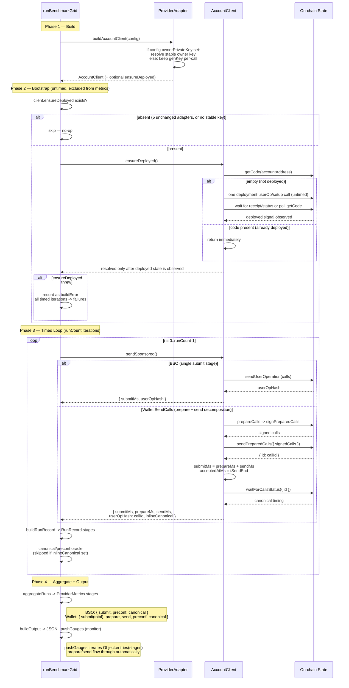
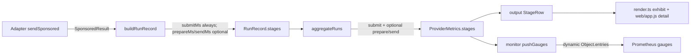

# feat: Stable owner account with self-bootstrap and Wallet SendCalls prepare/send stages

## Summary

Switch the two monitor adapters (MAv2 BSO and Wallet SendCalls) from random ephemeral owner accounts to a stable deterministic owner account (`OWNER_PRIVATE_KEY`) with self-bootstrap, so every run measures steady-state latency on an already-deployed account. Additionally, as an independent deliverable, refactor the Wallet SendCalls adapter from the `sendCalls` convenience method to the explicit `prepareCalls` → `signPreparedCalls` → `sendPreparedCalls` flow, measured as two separate "prepare" and "send" stages.

---

## Problem Frame

The benchmark measures per-stage transaction latency for sponsored smart-account writes, and the monitor runs hourly for regression detection. Today every run mints a fresh random owner account, so the first operation on a fresh account includes account deployment / EIP-7702 setup cost — injecting cold-start noise into what is supposed to be a steady-state pipeline measurement. `OWNER_PRIVATE_KEY` is already plumbed through config, secrets, and the monitor loop but never consumed by any adapter. (See origin for full product framing on the stable-account motivation.) Separately, the Wallet SendCalls adapter uses the single `sendCalls` convenience method, hiding the prepare-vs-send breakdown that aligns with the tool's per-stage decomposition philosophy — this prepare/send refactor is new scope introduced during planning, not derived from the origin, and should be independently shippable from the stable-owner bootstrap work.

---

## Requirements

- R1. The MAv2 BSO and Wallet SendCalls adapters must use `config.ownerPrivateKey` as the owner when it is set, reusing the same key across all timed iterations and across hourly runs. When unset, they preserve today's per-call random key behavior.
- R2. One `OWNER_PRIVATE_KEY` derives the owner for every configured EVM network for these two adapters. No per-network keys. Each (provider, network) pair is a distinct on-chain account instance with its own deployment state and nonce.
- R3. On startup, for each (provider, network), when a stable owner key is set the benchmark must check whether the deterministic account is deployed on-chain. If not deployed, it must run one deployment/setup operation and wait until deployedness is observable before any timed measurement. If already deployed, skip straight to timed measurement.
- R4. The deployment userOp run during bootstrap must be excluded from steady-state latency metrics and must not count toward `runCount`.
- R5. All `runCount` timed iterations must measure an already-deployed account's transaction latency. No cold-start/deployment cost may be included in steady-state metrics.
- R6. Failed or timed-out runs must be reported as failures in metrics. No active nonce-gap recovery. Recovery is operator-driven.
- R7. The monitor flow must require `OWNER_PRIVATE_KEY` (already enforced in `src/monitor/secrets.ts`).
- R8. The Wallet SendCalls adapter must replace `sendCalls` with the explicit `prepareCalls` → `signPreparedCalls` → `sendPreparedCalls` flow, measuring "prepare" (prepareCalls + signPreparedCalls) and "send" (sendPreparedCalls) as two separate latency stages. `submitMs` remains populated as the prepare+send total so existing consumers keep working.
- R9. The MAv2 BSO adapter keeps its single "submit" stage with no prepare/send decomposition. Only the Wallet SendCalls adapter reports "prepare" and "send" as optional decomposition stages on top of the `submit` total. The shared metrics/output schema adds optional prepare/send fields alongside the existing submit field.
- R10. Any error, log, JSON output, or monitor artifact produced from stable-owner code paths must redact the configured `OWNER_PRIVATE_KEY` value before serialization. Redaction applies to bootstrap failures, timed-run failures, build errors, and SDK/viem error messages.

**Origin actors:** A1 (Monitor — automated hourly runner), A2 (Operator — manual stuck-account intervention)
**Origin flows:** F1 (Self-bootstrap), F2 (Steady-state run), F3 (Stuck-account failure)
**Origin acceptance examples:** AE1 (fresh key → untimed deploy then steady-state), AE2 (deployed key → skip deploy), AE3 (one key → 8 account instances across networks/adapters), AE4 (stuck op → failure in metrics, no auto recovery)

---

## Scope Boundaries

- The other five adapters (Alchemy Light Account, Alchemy MAv2 non-BSO, Pimlico Safe, ZeroDev Kernel, ZeroDev UltraRelay) keep today's random-key behavior unconditionally — no stable-key consumption, no self-bootstrap.
- Cold-start / first-transaction benchmarking is out of scope; the deployment op is untimed and excluded from metrics.
- Active nonce-gap recovery (replace-by-fee, op replacement) and failure-streak alerting are out of scope. Operators handle rare stuck accounts manually.
- Out-of-band setup scripts for account deployment are out of scope; deployment is self-bootstrapped inline.
- Account-weight equivalence normalization across account types remains a known v1 limit per the README and is not addressed here.
- The "prepare"/"send" stage split is limited to the Wallet SendCalls adapter; no other adapter is refactored to split its submit stage.

### Deferred to Follow-Up Work

- Failure-streak alerting ("N consecutive failures for this (provider, network)"): surfaced during brainstorm as a way to disambiguate a stuck persistent account from a provider outage. Kept out of scope to minimize machinery; revisit if operators struggle to tell stuck-account from provider-down in the metrics.
- Self-bootstrap for the other five adapters: each has a different deployment mechanism and was not covered by the origin acceptance examples; add later if those adapters enter the monitor.

---

## Context & Research

### Relevant Code and Patterns

- `src/benchmark/providers/types.ts` — `AccountClient` interface (`sendSponsored()`) and `ProviderAdapter` (`buildAccountClient(config)`). This is where the `ensureDeployed` lifecycle hook will be added.
- `src/benchmark/providers/alchemy-mav2-bso.ts` — uses `privateKeyToAccount(key)` + `toModularAccountV2({ owner })`; `account.address` is available before sending. Comment at line 32 notes `getCode` is usable for `eth_call`/`getCode` on the read transport. `genKey` is injected for testing.
- `src/benchmark/providers/alchemy-wallet-sendcalls.ts` — uses `client.sendCalls({ calls })` then `client.waitForCallsStatus({ id })`. `signer.address` is the EIP-7702 account address. `inlineCanonical` is set because canonical timing resolves inside `sendSponsored`.
- `src/benchmark/service.ts` — `runBenchmarkGrid` builds account clients upfront via `adapter.buildAccountClient(config)`, then runs `runCount` timed iterations. Bootstrap belongs between build and the timed loop.
- `src/benchmark/contracts.ts` — `RunRecord.stages` (submit/preconf/canonical/providerReceipt), `StageMetrics`, `ProviderMetrics.stages`. `deploymentGas?: bigint` already exists on RunRecord, signaling deployment tracking was anticipated.
- `src/benchmark/aggregate.ts`, `src/benchmark/metrics.ts` (`buildRunRecord`), `src/benchmark/output.ts` (`StageRow`) — the stage pipeline that must learn prepare/send.
- `src/monitor/metrics.ts`, `src/monitor/loop.ts` (`pushGauges`) — monitor gauges keyed by stage; must learn prepare/send.
- `src/benchmark/config.ts` — `ownerPrivateKey?: 0x${string}` already on `Config`; `OWNER_PRIVATE_KEY` env var already parsed and validated. `config.network` (from `NETWORK`) and `config.providers.alchemy.rpcUrl` (`https://${NETWORK}.g.alchemy.com/v2/${apiKey}`) are already chain-specific — but the adapters currently ignore both and hardcode `chain: base`.
- `src/benchmark/metrics.ts` / `src/benchmark/service.ts` error paths — `serializeError` feeds `RunRecord.error` and output JSON. Stable-owner errors must redact the configured private key before serialization.
- `src/monitor/loop.ts` — `KNOWN_NETWORKS` maps network strings to viem `Chain` objects; `resolveChain` resolves the chain for the neutral oracle. The adapters need an equivalent benchmark-layer resolver (U5).
- `@alchemy/common` `alchemyTransport({ apiKey })` — derives its RPC URL from the `Chain` passed to the client constructor (JSDoc: "defaults to chain's Alchemy URL"), with an optional `url` override. So passing the correct chain instead of hardcoded `base` makes the transport use the right chain-specific Alchemy URL automatically.
- `src/monitor/secrets.ts` — already requires and validates `OWNER_PRIVATE_KEY` for the monitor flow.
- `@alchemy/wallet-apis` SDK — `SmartWalletActions` exposes `prepareCalls`, `signPreparedCalls`, `sendPreparedCalls` as separate methods (verified in `node_modules/@alchemy/wallet-apis/dist/types/decorators/smartWalletActions.d.ts`). JSDoc confirms the flow: prepare → sign → sendPreparedCalls returns a call ID; `waitForCallsStatus` still resolves canonical.

### Institutional Learnings

- No `docs/solutions/` directory exists in this repo.

### External References

- None — local SDK type definitions and codebase patterns are sufficient.

---

## Key Technical Decisions

- **Stable key resolved at `buildAccountClient` time, reused across all N iterations; random fallback preserves per-call generation when unset.** When `OWNER_PRIVATE_KEY` is set, the adapter resolves the owner once at build time and reuses it so the deterministic account address is known for the bootstrap `getCode` check. When unset, the adapter keeps today's `genKey()`-per-`sendSponsored` behavior so CLI local-dev ergonomics and the N-fresh-accounts behavior are unchanged.
- **Self-bootstrap via an optional `ensureDeployed()` on `AccountClient`, called by the service before the timed loop.** Keeps deployment (provider-specific) out of the generic `buildAccountClient` constructor while letting the service control timing and guarantee exclusion from metrics. Adapters without self-bootstrap omit the method; the service no-ops when absent. Rejected alternatives: (a) folding `ensureDeployed` into `buildAccountClient` — mixes on-chain I/O with object construction and makes deployment failure indistinguishable from build failure; (b) a separate `LifecycleHook` interface — over-engineering for one optional method when `AccountClient` is already the per-instance abstraction; (c) a service-side `getCode` check — violates the provider abstraction since the service would need to know adapter-specific deployment semantics (counterfactual vs EIP-7702).
- **Deployment check via `getCode` on the deterministic account address, with confirmation before timed runs.** For MAv2 (counterfactual), empty `getCode` ⇒ not deployed; the first `sendUserOperation` deploys it. For EIP-7702, `getCode` on the signer EOA reveals whether 7702 delegation is set; the first `sendCalls`/`sendPreparedCalls` includes the auth setup. `ensureDeployed` must not resolve immediately after submission — it waits for receipt/status or polls `getCode` until the deployed/delegated state is observable, with timeout treated as bootstrap failure. Exact mechanism per account type is verified during implementation.
- **"prepare" and "send" as optional decomposition stages; "submit" stays populated as the prepare+send total for Wallet SendCalls.** Rather than omitting `submit` for Wallet SendCalls (which would break the four downstream consumers that hardcode `submit`: the `aggregateRuns` success filter, `buildRunRecord`, `render.ts`'s exhibit, and `web/app.js`'s dashboard), Wallet SendCalls populates `submitMs = prepareMs + sendMs` as the total submit latency AND adds `prepareMs`/`sendMs` as optional decomposition fields. `SponsoredResult` gains optional `prepareMs?`/`sendMs?` (with `submitMs` staying required). This preserves backward compatibility for all existing success-path consumers while still providing the prepare-vs-send breakdown in the exhibit/detail views. BSO and the five unchanged adapters keep `submit` only, with no `prepare`/`send`.
- **"prepare" stage spans `prepareCalls` + `signPreparedCalls`; "send" stage spans `sendPreparedCalls`.** Signing is paired with prepare because it is part of building the submittable user operation; the send stage is the submission round-trip alone.

---

## Open Questions

### Resolved During Planning

- **CLI fallback behavior (origin deferred question):** `OWNER_PRIVATE_KEY` stays optional in config. When set, the two monitor adapters use the stable key + self-bootstrap. When unset, they preserve current random behavior. The monitor requires it (already enforced in `secrets.ts`).
- **Scope of stable-key consumption (synthesis call-out):** limited to MAv2 BSO and Wallet SendCalls per user direction. The other five adapters are untouched.
- **MAv2 BSO stage model (synthesis call-out):** BSO keeps its single "submit" stage. Only Wallet SendCalls reports prepare+send.
- **Prepare/send scope extension (doc-review):** the prepare/send stage split (R8/R9) is new scope introduced during planning per explicit user direction, not derived from the origin document. It is intentional and user-approved.
- **Adapters hardcode `chain: base` — resolved: make adapters network-aware (U5).** Both target adapters imported `base` from `viem/chains` and hardcoded `chain: base` in every client constructor, never referencing `config.network`. Per user direction, the adapters will resolve the viem `Chain` from `config.network` and pass it to their client constructors so `alchemyTransport` derives the correct chain-specific Alchemy URL. This is a new implementation unit (U5) and a prerequisite for R2/AE3 multi-network support. Note: `config.providers.alchemy.rpcUrl` is already chain-specific (`https://${NETWORK}.g.alchemy.com/v2/${apiKey}`) but the adapters ignored it; U5 makes the adapters honor `config.network`.
- **Private-key redaction in error messages — resolved: redact stable-key errors before serialization (U7).** Error messages from `ensureDeployed`/stable-key code paths flow through `serializeError` into `RunRecord.error` and output JSON, but only the config block is currently redacted (`redactConfig`). U7 promotes this from implementation-time confirmation to a requirement: redact the configured `OWNER_PRIVATE_KEY` from serialized errors, logs, and monitor/output artifacts, with tests that inject the key into thrown error messages.

### Deferred to Implementation

- **`sendPreparedCalls` call pattern ambiguity:** the SDK type `SendPreparedCallsParams` is the signed-call object itself (with `type`/`data`/`signature`), and the `signPreparedCalls.d.ts` JSDoc shows `sendPreparedCalls(signedCalls)` (direct pass), while the `sendPreparedCalls.d.ts` JSDoc shows `sendPreparedCalls({ signedCalls })` (wrapped). The directional code in U6 names both forms — confirm the correct pattern at runtime during implementation and adjust. Either way the flow is prepare → sign → send; only the argument shape is in question.
- **Exact `getCode` / deployment-state check per adapter:** confirm whether the first `sendUserOperation` (MAv2) and first `sendPreparedCalls`/`sendCalls` (EIP-7702) reliably deploy/set up the account, and whether `getCode` is the right deployedness signal for each. Verify what `getCode(signer.address)` returns before/after 7702 delegation for EIP-7702.
- **MAv2 counterfactual address derivation inputs:** confirm `toModularAccountV2({ owner })` derives the address from owner alone (not chain), so one key yields one account per chain. Does not affect the single-key design but should be confirmed when wiring the bootstrap check.
- **EIP-7702 setup op flow:** U4 initially uses the existing `sendCalls` path for setup so stable-owner bootstrap can ship independently. During U6, confirm whether the initial 7702 auth setup can also use prepare→sign→send; if yes, share that helper with timed runs, and if not, document the split and keep both paths covered by tests.

---

## High-Level Technical Design

> *This illustrates the intended approach and is directional guidance for review, not implementation specification. The implementing agent should treat it as context, not code to reproduce.*

The benchmark run has four phases. The bootstrap phase (new) sits between client construction and the timed loop, and is excluded from all metrics. Within the timed loop, the two monitor adapters follow different stage models: BSO reports a single `submit` stage; Wallet SendCalls reports `prepare` + `send` decomposition stages while still populating `submit` as their total.

The stage data flows through a fixed pipeline. The `submit` field stays present for every adapter (preserving the four downstream consumers that hardcode it); `prepare`/`send` are optional decomposition fields that only Wallet SendCalls populates and only the exhibit/detail views consume.

---

## Implementation Units

### U1. ensureDeployed lifecycle hook in AccountClient + service orchestration

**Goal:** Add an optional deployment-ensure step to the account lifecycle that the service runs once after `buildAccountClient` and before the timed loop, excluded from all metrics.

**Requirements:** R3, R4, R5

**Dependencies:** None

**Files:**
- Modify: `src/benchmark/providers/types.ts`
- Modify: `src/benchmark/service.ts`
- Test: `src/benchmark/service.test.ts`

**Approach:**
- Add an optional `ensureDeployed?(): Promise<void>` method to the `AccountClient` interface.
- In `runBenchmarkGrid`, after the `buildAccountClient` `Promise.allSettled` block and before the timed iteration loop, call `ensureDeployed()` on each client that exposes it. Wrap in try/catch so a bootstrap failure is recorded as a build error for that provider (same pattern as existing `buildErrors` handling) rather than crashing the grid.
- The bootstrap call is outside the timed loop, so it is naturally excluded from `runCount` and latency metrics.
- When a client does not expose `ensureDeployed` (the five unchanged adapters, or the two monitor adapters when no stable key is set), the service skips it.

**Patterns to follow:**
- Existing `buildErrors` map + per-provider error isolation in `src/benchmark/service.ts`.

**Test scenarios:**
- Happy path: a client with `ensureDeployed` is called exactly once before the timed loop; its `sendSponsored` is called `runCount` times only after the `ensureDeployed` promise resolves.
- Edge case: a client without `ensureDeployed` is skipped; the timed loop runs normally for it.
- Error path: `ensureDeployed` throws → all `runCount` iterations for that provider are recorded as failures with the bootstrap error message; other providers are unaffected.
- Integration: bootstrap is not counted in any stage metric or `runCount`; verify the resulting `ProviderMetrics.runCount` equals the configured `runCount` and no bootstrap time leaks into stage medians.

**Verification:**
- `bun test src/benchmark/service.test.ts` passes with new scenarios; the service calls `ensureDeployed` exactly once per client that exposes it, before any timed `sendSponsored`.

---

### U2. Metrics/output schema for prepare and send decomposition stages

**Goal:** Extend the shared stage schema so the Wallet SendCalls adapter can report "prepare" and "send" as optional decomposition stages on top of the existing "submit" total, while BSO and other adapters keep "submit" only. Update all downstream consumers that hardcode `submit` to handle the new optional stages.

**Requirements:** R8, R9

**Dependencies:** None (schema is a prerequisite for U6 but has no upstream unit)

**Files:**
- Modify: `src/benchmark/providers/types.ts` — add optional `prepareMs?`/`sendMs?` to `SponsoredResult`; keep `submitMs` required (Wallet SendCalls will set `submitMs = prepareMs + sendMs`)
- Modify: `src/benchmark/contracts.ts` — add optional `prepare?: Stage` and `send?: Stage` to `RunRecord.stages`; extend `ProviderMetrics.stages` and `StageRow` accordingly
- Modify: `src/benchmark/metrics.ts` — `buildRunRecord` reads optional `sponsored.prepareMs`/`sendMs` and creates `prepare`/`send` stages when present; the `submit-failed` variant leaves prepare/send absent because no `SponsoredResult` was returned
- Modify: `src/benchmark/aggregate.ts` — aggregate `prepare`/`send` when present, mirroring `submit`; the success filter already checks `r.stages.submit.status === 'ok'` which stays valid because `submit` remains populated for all adapters
- Modify: `src/benchmark/output.ts` — `StageRow` gains optional `prepare?`/`send?` blocks
- Modify: `src/cli/render.ts` — the Wallet SendCalls exhibit (and any per-protocol-class exhibit) shows Prepare/Send columns alongside or instead of the Submit column when prepare/send are present
- Modify: `web/app.js` — extend the `stages` array and `stageLabels` to include prepare/send; the detail panel shows prepare/send med/p95 when present; the summary "Fastest submit" and table keep reading `submit` (still populated)
- Modify: `src/monitor/metrics.ts`, `src/monitor/loop.ts` — confirm `pushGauges` flows prepare/send through automatically (it already iterates `Object.entries(pm.stages)`); add any label support if needed
- Test: `src/benchmark/aggregate.test.ts`
- Test: `src/benchmark/output.test.ts`

**Approach:**
- **Compatibility-total design:** `SponsoredResult.submitMs` stays required. Wallet SendCalls sets `submitMs = prepareMs + sendMs` and additionally sets `prepareMs`/`sendMs`. This means the four downstream consumers that hardcode `submit` (the `aggregateRuns` success filter, `buildRunRecord`'s `submit` stage, `render.ts` exhibits, `web/app.js` summary/table) keep working without changes to their success-path logic. Only the exhibit/detail views need to surface the optional `prepare`/`send` decomposition.
- `buildRunRecord` creates `prepare`/`send` stages only when a successful `SponsoredResult` includes `sponsored.prepareMs`/`sendMs`; otherwise those stage slots are absent. There is no separate `prepare-failed` or `send-failed` stage status in v1: any failure before a `SponsoredResult` returns is represented by the existing `submit` failure path, with prepare/send decomposition omitted for that run.
- `aggregateRuns` aggregates `prepare`/`send` when the stage is present on successful records, mirroring the existing `submit` `computeStageMetrics`/`collectMs` pattern.
- The monitor `pushGauges` already iterates `Object.entries(pm.stages)`, so `prepare`/`send` flow through as new `stage` label values with no structural change — confirm during implementation.

**Patterns to follow:**
- Existing `submit` stage handling across `aggregate.ts` (`computeStageMetrics`, `collectMs`), `metrics.ts` (`buildRunRecord` + `makeStage`), `output.ts` (`StageRow`), `render.ts` (`fmtStage`), and `monitor/loop.ts` (`pushGauges`).

**Test scenarios:**
- Happy path: a RunRecord with `submit`, `prepare`, and `send` stages aggregates into `ProviderMetrics.stages` with all three; `submit` median equals the prepare+send total distribution.
- Edge case: a RunRecord with only `submit` (BSO-style) aggregates unchanged; `prepare`/`send` are absent from the metrics.
- Edge case: mixed results where some runs have prepare/send and others failed — failed runs do not contribute to prepare/send stage metrics (count reflects only successful samples), matching existing submit behavior.
- Edge case: `submit-failed` variant — `prepare`/`send` are absent; `submit` is `failed`; the run counts as a failure. Partial prepare/send timings from failed submissions are not persisted in v1.
- Integration: `buildOutput` / `serializeOutput` produce JSON with `prepare` and `send` blocks when present and omit them when absent.
- Integration: `pushGauges` emits prepare/send P50/P95/P99 gauges with the correct labels when those stages are present.
- Integration: `render.ts` Wallet SendCalls exhibit shows Prepare/Send columns; `web/app.js` detail panel shows prepare/send med/p95 when present.

**Verification:**
- `bun test src/benchmark/aggregate.test.ts src/benchmark/output.test.ts` passes; prepare/send stages aggregate and serialize correctly alongside the existing submit stage. The existing `submit`-only test cases still pass unchanged.

---

### U3. MAv2 BSO stable owner key + self-bootstrap

**Goal:** Make the MAv2 BSO adapter use `config.ownerPrivateKey` when set and self-bootstrap the deterministic account on first run, while preserving random behavior when unset.

**Requirements:** R1, R2, R3, R4, R5, R6

**Dependencies:** U1 (ensureDeployed interface + service call), U5 (network-aware chain resolution)

**Files:**
- Modify: `src/benchmark/providers/alchemy-mav2-bso.ts`
- Test: `src/benchmark/providers/alchemy-mav2-bso.test.ts` (create if absent)

**Approach:**
- In `buildAccountClient`, when `config.ownerPrivateKey` is set, resolve the owner from it once and store it on the client; the client reuses this owner for every `sendSponsored` call instead of calling `genKey()` per call. When unset, keep today's `genKey()`-per-call behavior.
- Implement `ensureDeployed()`: compute the deterministic account address (available from `toModularAccountV2({ owner })` without sending), then `getCode(accountAddress)` via the read transport. If `getCode` returns code, return immediately. If empty/undefined, run one untimed deployment `sendUserOperation` (same calls shape as a normal run: to dead address, zero gas fields, BSO-sponsored), then wait until deployment is observed before returning — either by waiting for the userOp receipt when available or polling `getCode(accountAddress)` until non-empty with a bounded timeout. A timeout or failed receipt is a bootstrap failure.
- `ensureDeployed` is only meaningful when a stable key is set; when unset (random mode), omit the method or make it a no-op so the service skips it.
- BSO keeps its single "submit" stage — no prepare/send split here.

**Patterns to follow:**
- Existing `sendSponsored` in `alchemy-mav2-bso.ts` for the deployment userOp shape (same target/gas/transport setup).
- `genKey` injection pattern for testability — keep injecting a key generator for the random path so tests can control it.

**Test scenarios:**
- Covers AE1. Given a stable owner key whose account is not deployed, when `ensureDeployed` runs, then it sends one deployment userOp and does not resolve until the account is observably deployed; a subsequent `sendSponsored` measures steady-state on the now-deployed account.
- Covers AE2. Given the same stable key on a later run where the account is deployed, when `ensureDeployed` runs, then `getCode` returns code and no deployment userOp is sent.
- Happy path (stable key): `sendSponsored` uses the same owner address across N calls (not a fresh key each time).
- Happy path (no key): when `config.ownerPrivateKey` is unset, `sendSponsored` calls `genKey()` per call as today; `ensureDeployed` is absent or a no-op.
- Error path: the deployment userOp fails, its receipt/status fails, or deployedness polling times out → `ensureDeployed` throws, and the service records all timed iterations as failures for this provider.
- Edge case: `getCode` check itself fails (RPC error) → `ensureDeployed` throws with a descriptive error.
- Covers AE4 (R6): a timed `sendSponsored` failure is recorded as a failure in metrics with no automatic recovery (existing behavior — verify it still holds alongside the bootstrap changes).
- Covers AE3 (R2): one owner key derives the same account address on each network it runs on; multi-network independence depends on U5 resolving the chain from `config.network`.

**Verification:**
- `bun test` for the MAv2 BSO adapter passes; with a stable key, the account is deployed once, `ensureDeployed` waits for observed deployed state before resolving, the owner is reused, and submit metrics exclude the deployment op.

---

### U4. Wallet SendCalls stable owner key + self-bootstrap

**Goal:** Make the Wallet SendCalls adapter use `config.ownerPrivateKey` when set and self-bootstrap the deterministic EIP-7702 account, while preserving the current `sendCalls` submit behavior. The prepare/send refactor is split into U6 so stable-owner work can ship independently from the stage-schema/reporting change.

**Requirements:** R1, R2, R3, R4, R5, R6

**Dependencies:** U1 (ensureDeployed interface), U5 (network-aware chain resolution)

**Files:**
- Modify: `src/benchmark/providers/alchemy-wallet-sendcalls.ts`
- Test: `src/benchmark/providers/alchemy-wallet-sendcalls.test.ts` (create if absent)

**Approach:**
- Stable key + bootstrap: same pattern as U3. When `config.ownerPrivateKey` is set, resolve the signer once at build time and reuse it. When unset, keep `genKey()`-per-call behavior and omit/no-op `ensureDeployed`.
- Keep timed `sendSponsored` on the existing `client.sendCalls({ calls })` flow in this unit. It continues to populate the existing single `submitMs` stage and `inlineCanonical` exactly as today, using the stable signer when configured.
- Implement `ensureDeployed()`: `getCode(signer.address)` checks the EIP-7702 delegation/deployedness signal. If code is already present, return immediately. If not set, run one untimed setup op using the current `sendCalls` path, wait for setup success via `waitForCallsStatus({ id })` and/or poll `getCode(signer.address)` until the expected delegation signal is observable, then return. A timeout or failed setup status is a bootstrap failure.
- The setup op is untimed and excluded from metrics by U1's service orchestration. The setup op advances the account nonce — expected and accepted; the first timed run uses the next nonce, managed by the wallet API.
- U6 may later replace the timed `sendCalls` path with prepare/sign/send. If U6 lands after U4, it should reuse U4's stable signer and deployedness hook instead of re-implementing bootstrap.

**Patterns to follow:**
- Existing `sendSponsored` in `alchemy-wallet-sendcalls.ts` for the dead-address target, `sendCalls`, `waitForCallsStatus` canonical flow, and `inlineCanonical` construction.
- `createClient` / `genKey` injection for testability — keep injecting so tests can mock the SDK calls.

**Test scenarios:**
- Covers AE1. Given a stable owner key whose EIP-7702 delegation is not set, when `ensureDeployed` runs, then it runs one untimed setup op and does not resolve until setup success/delegation is observed; subsequent `sendSponsored` measures steady-state.
- Covers AE2. Given the delegation is already set, when `ensureDeployed` runs, then no setup op is sent.
- Happy path (stable key): the same signer address is used across N `sendSponsored` calls.
- Happy path (no key): when `config.ownerPrivateKey` is unset, `genKey()` runs per call as today; `ensureDeployed` is absent/no-op.
- Error path: setup submission fails, setup status fails, or deployedness polling times out → `ensureDeployed` throws, and the service records all timed iterations as failures for this provider.
- Integration: `inlineCanonical` is still set so the service skips the neutral canonical oracle; `waitForCallsStatus` resolves canonical as today.
- Covers AE4 (R6): a timed `sendSponsored` failure is recorded as a failure in metrics with no automatic recovery.

**Verification:**
- `bun test` for the Wallet SendCalls adapter passes; with a stable key the account is set up once, `ensureDeployed` waits for observed setup before resolving, the signer is reused, and submit metrics exclude the setup op.

---

### U5. Make MAv2 BSO and Wallet SendCalls adapters network-aware

**Goal:** Replace the hardcoded `chain: base` in the two target adapters with a `Chain` resolved from `config.network`, so the adapters submit to the configured network and `alchemyTransport` derives the correct chain-specific Alchemy RPC URL. This is a prerequisite for R2/AE3 (one key → distinct account instances across 4 networks).

**Requirements:** R2, R5

**Dependencies:** None (independent of U1–U4; can land first)

**Files:**
- Modify: `src/benchmark/providers/alchemy-mav2-bso.ts` — replace `chain: base` in `createPublicClient` and `createBundlerClient` with the resolved chain
- Modify: `src/benchmark/providers/alchemy-wallet-sendcalls.ts` — replace `chain: base` in `createSmartWalletClient` with the resolved chain
- Create or modify: a shared chain-resolution helper in `src/benchmark/` (e.g. `src/benchmark/chains.ts`) mapping `config.network` strings (`eth-mainnet`, `base-mainnet`, `opt-mainnet`, `arb-mainnet`) to viem `Chain` objects
- Test: `src/benchmark/providers/alchemy-mav2-bso.test.ts`
- Test: `src/benchmark/providers/alchemy-wallet-sendcalls.test.ts`

**Approach:**
- The monitor loop already has a `KNOWN_NETWORKS` map in `src/monitor/loop.ts`, but that is monitor-scoped. Extract or mirror a benchmark-layer chain resolver so the CLI and monitor both use it. The helper takes a network string and returns a viem `Chain` (falling back to a sensible default or throwing for unknown networks).
- The adapters receive `config.network` (already on `Config`) and resolve the `Chain` in `buildAccountClient`/`sendSponsored`, passing it to `createPublicClient`, `createBundlerClient`, and `createSmartWalletClient`. `alchemyTransport({ apiKey })` derives the chain-specific Alchemy URL from the chain passed to the client constructor (per its JSDoc: "defaults to chain's Alchemy URL"), so no explicit `url` override is needed — though `config.providers.alchemy.rpcUrl` (already chain-specific) can be passed as the `url` override if the SDK requires it.
- The five unchanged adapters are out of scope and keep `chain: base` for now.

**Patterns to follow:**
- `resolveChain` + `KNOWN_NETWORKS` in `src/monitor/loop.ts` for the network→Chain mapping.
- `config.providers.alchemy.rpcUrl` construction in `src/benchmark/config.ts` (already chain-specific via `https://${raw.NETWORK}.g.alchemy.com/v2/${apiKey}`).

**Test scenarios:**
- Happy path: with `config.network = 'eth-mainnet'`, the adapter constructs clients with the Ethereum chain; `alchemyTransport` resolves to the Ethereum Alchemy URL.
- Happy path: with `config.network = 'base-mainnet'`, behavior matches today (Base chain, Base Alchemy URL).
- Edge case: an unknown network string → the resolver throws a descriptive error (or falls back to a documented default) rather than silently using Base.
- Integration: across `eth-mainnet`, `base-mainnet`, `opt-mainnet`, `arb-mainnet`, the adapter hits the correct chain's Alchemy endpoint (verify the transport URL or a mocked RPC call targets the right chain id).
- Covers AE3 (R2): one owner key derives account instances on each resolved chain; the 4 networks produce distinct on-chain account instances.

**Verification:**
- `bun test` for both adapters passes; the adapters use the chain resolved from `config.network` instead of hardcoded `base`, and the Alchemy transport URL is chain-specific.

---

### U6. Wallet SendCalls prepare/send stage refactor

**Goal:** Replace the Wallet SendCalls adapter's timed `sendCalls` convenience path with the explicit `prepareCalls` → `signPreparedCalls` → `sendPreparedCalls` flow, measured as `prepare` and `send` decomposition stages while preserving `submitMs` as the compatibility total.

**Requirements:** R8, R9

**Dependencies:** U2 (prepare/send stage schema), U4 (stable signer/bootstrap path, if U4 has landed)

**Files:**
- Modify: `src/benchmark/providers/alchemy-wallet-sendcalls.ts`
- Test: `src/benchmark/providers/alchemy-wallet-sendcalls.test.ts`

**Approach:**
- Refactor only the timed `sendSponsored` path. Reuse U4's stable signer and `ensureDeployed` behavior when present; do not mix bootstrap responsibilities into this unit.
- Replace `client.sendCalls({ calls })` with:
  1. `prepareCalls({ calls, capabilities: { paymaster: { policyId } } })` → returns prepared calls + signature request. (The client is already constructed with the paymaster capability, so per-call capabilities may be redundant — rely on client-level caps during implementation if the SDK allows it.)
  2. `signPreparedCalls(preparedCalls)` → returns signed calls (accepts the whole `prepareCalls` result).
  3. `sendPreparedCalls({ signedCalls })` or `sendPreparedCalls(signedCalls)` depending on the runtime-confirmed SDK shape → returns the call ID.
- Measure two decomposition stages: `prepare` = elapsed time of `prepareCalls` + `signPreparedCalls`; `send` = elapsed time of `sendPreparedCalls`. **Also populate `submitMs = prepareMs + sendMs` as the compatibility total** so downstream consumers that hardcode `submit` keep working (per U2's compatibility-total design).
- Set `acceptedAtMs = tSendEnd` (the timestamp after `sendPreparedCalls` returns the call ID) — the service uses `acceptedAtMs` for preconf/canonical stage calibration, so this must reflect the actual acceptance moment.
- Keep `waitForCallsStatus({ id })` for canonical timing and keep setting `inlineCanonical` on the `SponsoredResult` so the service skips the neutral canonical oracle for this adapter.
- Failure contract: if `prepareCalls`, `signPreparedCalls`, or `sendPreparedCalls` throws before a `SponsoredResult` is returned, the run uses the existing `submit` failure path and does not persist partial `prepare`/`send` stages. Do not introduce `prepare-failed` or `send-failed` statuses in v1.

**Technical design:**
> *Directional guidance, not implementation specification.*
>
> In `sendSponsored`:
> - `tPrepareStart = performance.now()`
> - `prepared = await client.prepareCalls({ calls, capabilities: { paymaster: { policyId } } })`
> - `signed = await client.signPreparedCalls(prepared)`
> - `tPrepareEnd = performance.now()` → `prepareMs = tPrepareEnd - tPrepareStart`
> - `tSendStart = performance.now()`
> - `{ id: callId } = await client.sendPreparedCalls({ signedCalls: signed })` (or direct `signed` argument if runtime types require it)
> - `tSendEnd = performance.now()` → `sendMs = tSendEnd - tSendStart`; `acceptedAtMs = tSendEnd`
> - `submitMs = prepareMs + sendMs` (compatibility total)
> - canonical via `waitForCallsStatus({ id })` as today.
>
> Return `SponsoredResult` with `submitMs`, `prepareMs`, `sendMs`, `userOpHash: callId`, `acceptedAtMs`, and `inlineCanonical`.

**Patterns to follow:**
- Existing Wallet SendCalls dead-address target, `waitForCallsStatus` canonical flow, and `inlineCanonical` construction.
- SDK method shapes from `node_modules/@alchemy/wallet-apis/dist/types/decorators/smartWalletActions.d.ts` and the `prepareCalls`/`sendPreparedCalls` action JSDoc.

**Test scenarios:**
- Happy path (prepare/send): `sendSponsored` calls `prepareCalls` → `signPreparedCalls` → `sendPreparedCalls` in order; `prepare` stage time covers the first two calls, `send` stage time covers the third; `submitMs` equals `prepareMs + sendMs`.
- Error path: `prepareCalls` fails → the run is recorded as submit-failed; `sendPreparedCalls` is not called; no prepare/send stage is serialized.
- Error path: `sendPreparedCalls` fails → the run is recorded as submit-failed; no partial prepare/send stage is serialized.
- Integration: `inlineCanonical` is still set so the service skips the neutral canonical oracle; `waitForCallsStatus` resolves canonical as today.
- Edge case: `sendPreparedCalls` succeeds but `waitForCallsStatus` returns failure → `inlineCanonical.status = 'integrity-fail'` as today.
- Integration: `acceptedAtMs` is set to the post-`sendPreparedCalls` timestamp so preconf/canonical stage timing is calibrated correctly.

**Verification:**
- `bun test` for the Wallet SendCalls adapter passes; the prepare/send flow runs in order, `submitMs = prepareMs + sendMs`, all three stage metrics are populated for successful runs, and failed submissions keep the existing submit-failed representation.

---

### U7. Redact owner private key from stable-owner error paths

**Goal:** Ensure `OWNER_PRIVATE_KEY` never appears in serialized errors, JSON output, logs, or monitor artifacts produced by bootstrap or timed stable-owner failures.

**Requirements:** R10

**Dependencies:** U1, U3, U4 (the stable-owner paths that can surface errors)

**Files:**
- Modify: `src/benchmark/metrics.ts` and/or shared error serialization helper used by `buildRunRecord`
- Modify: `src/benchmark/service.ts` if build/bootstrap errors are serialized outside `buildRunRecord`
- Test: `src/benchmark/metrics.test.ts` and/or `src/benchmark/service.test.ts`

**Approach:**
- Add a redaction helper that receives the configured `ownerPrivateKey` and removes exact occurrences from serialized error messages, stack traces, causes, and object-shaped error payloads before they enter `RunRecord.error`, build-error records, output JSON, or monitor metrics/log labels.
- Apply redaction to both bootstrap (`ensureDeployed`) failures and timed `sendSponsored` failures. The helper should be defensive: if no `ownerPrivateKey` is configured, behavior is unchanged; if an error contains the key with or without `0x`, redact both forms when possible.
- Keep `redactConfig` for config display, but do not rely on it for error text — error serialization needs its own stable-key redaction because SDK/viem exceptions can include input values.
- Use a clear placeholder such as `[REDACTED_OWNER_PRIVATE_KEY]` so operators can tell redaction occurred without exposing the value.

**Test scenarios:**
- Bootstrap error path: `ensureDeployed` throws an `Error` whose message contains the configured private key → every generated failure record contains `[REDACTED_OWNER_PRIVATE_KEY]` and not the key.
- Timed run error path: `sendSponsored` throws an object/string/`Error` containing the key in message, stack, or cause → serialized `RunRecord.error` is redacted.
- No-key path: when `ownerPrivateKey` is unset, error serialization output is unchanged.
- Regression: existing `redactConfig` behavior still redacts config display.

**Verification:**
- `bun test src/benchmark/metrics.test.ts src/benchmark/service.test.ts` passes; grep the generated test output/fixtures to confirm the configured private key never appears.

---

## System-Wide Impact

- **Interaction graph:** `runBenchmarkGrid` gains a new bootstrap phase between client build and the timed loop. The monitor loop (`src/monitor/loop.ts`) is unchanged in structure — it calls `runBenchmarkGrid`, which now handles bootstrap internally. `pushGauges` flows new stage labels through automatically once the stage keys exist.
- **Error propagation:** A bootstrap (`ensureDeployed`) failure is treated like a build failure — all timed iterations for that provider are recorded as failures; other providers are isolated. Same isolation pattern as existing `buildErrors`. Stable-owner failures must pass through U7's redaction helper before reaching `RunRecord.error`, output JSON, monitor artifacts, or logs.
- **State lifecycle risks:** A persistent account accumulates nonces across hourly runs. A stuck/dropped userOp could block subsequent runs for that (provider, network). Accepted per origin (trust-the-API, operator-driven recovery). No automatic nonce-gap recovery.
- **API surface parity:** The `AccountClient` interface gains an optional method — existing adapters that do not implement it are unaffected (the service checks for its presence). `SponsoredResult` gains optional `prepareMs`/`sendMs` while `submitMs` stays required, so existing consumers that read `submit` keep working. `RunRecord`/`StageRow`/`ProviderMetrics` gain optional `prepare`/`send` fields. Four downstream consumers hardcode `submit` (`aggregate.ts` success filter, `metrics.ts` buildRunRecord, `render.ts` exhibits, `web/app.js` dashboard) — U6's compatibility-total design (`submitMs = prepareMs + sendMs`) keeps their success-path logic intact; only the exhibit/detail views need to surface the decomposition.
- **Integration coverage:** The prepare/send stage pipeline (adapter → RunRecord → aggregate → output → monitor gauges) should be verified end-to-end with a mock SDK run in U6, since unit tests on each layer alone will not prove the stage keys flow all the way through to Prometheus gauges. Stable-owner bootstrap can ship before U6 because U4 preserves the existing single-submit Wallet SendCalls path.
- **Unchanged invariants:** The neutral canonical oracle is unchanged — Wallet SendCalls still resolves canonical inline via `waitForCallsStatus`; BSO still uses the neutral oracle. The five unchanged adapters' behavior (random keys, single submit stage, no bootstrap) is explicitly preserved. `OWNER_PRIVATE_KEY` config parsing, secrets validation, and loop env injection are already correct and unchanged.

---

## Risks & Dependencies

| Risk | Mitigation |
|------|------------|
| **Adapters hardcoded `chain: base` — R2/AE3 multi-network unfulfillable** | Resolved by U5: adapters resolve `Chain` from `config.network` and pass it to client constructors so `alchemyTransport` uses the chain-specific Alchemy URL. Pre-existing limitation fixed by this plan. |
| Persistent account gets stuck (nonce gap), blocking all future hourly runs for a (provider, network) | Accepted per origin. Failures surface in metrics; operator intervenes manually. No active recovery built. |
| `prepareCalls`/`sendPreparedCalls` SDK flow differs from the JSDoc example at runtime (e.g. `signPreparedCalls` signature mismatch) | Deferred to U6 implementation — confirm the exact call sequence by reading SDK runtime behavior; the adapter keeps SDK calls injectable for testability. SDK type defs verified: `signPreparedCalls` accepts the whole `prepareCalls` result; `sendPreparedCalls` takes `{ signedCalls }`, but the runtime argument shape must be verified. |
| `getCode` is not the right deployedness signal for EIP-7702 (delegated code vs account code) | Deferred to implementation — verify what `getCode(signer.address)` returns before/after 7702 setup and adjust the check accordingly. |
| MAv2 counterfactual address derivation depends on more than the owner (chain, salt) | Does not affect the single-key design (one key still derives the account per chain). Confirm derivation inputs during implementation so the bootstrap `getCode` checks the right address. |
| Four downstream consumers hardcode `submit` and would break if Wallet SendCalls omitted it | Mitigated by U6's compatibility-total design: Wallet SendCalls populates `submitMs = prepareMs + sendMs`, so `aggregate.ts` (success filter), `metrics.ts` (`buildRunRecord`), `render.ts`, and `web/app.js` keep working on their success paths. Only the exhibit/detail views are updated (U2) to surface the prepare/send decomposition. |
| The bootstrap deployment op advances the account nonce, shifting the first timed run's nonce | Expected and accepted — the wallet/bundler API manages nonces; the first timed run uses the next nonce. Documented as accepted behavior. |
| `ensureDeployed` using `sendCalls` while U6 uses prepare/sign/send for timed runs creates maintenance divergence | Accepted as the cost of keeping stable-owner bootstrap independently shippable. Prefer to migrate setup to the same prepare/sign/send helper during U6 if the SDK supports initial EIP-7702 setup through that path; otherwise document the split and keep both paths covered by tests. |
| SDK/viem errors include the configured `OWNER_PRIVATE_KEY` | Mitigated by U7: redact exact key values from every serialized error/log/output path and test bootstrap + timed failures that deliberately include the key. |

---

## Documentation / Operational Notes

- `.env.example` already lists `OWNER_PRIVATE_KEY` (commented out). Update the comment to reflect that it is now consumed by the MAv2 BSO and Wallet SendCalls adapters and is required for the monitor flow.
- `src/cli/render.ts` line 101 documents "Uses wallet_sendCalls (EIP-5792)" — update to reflect the new `prepareCalls`/`sendPreparedCalls` flow and the prepare/send stage split. The Wallet SendCalls exhibit's Prepare/Send columns are handled in U2.
- `web/app.js` hardcodes a `submit`-only stage view — U2 extends the dashboard's stage array, labels, and detail panel to surface prepare/send when present.
- **Private key trust boundary:** `OWNER_PRIVATE_KEY` is used only for local signing via `privateKeyToAccount()`. The derived owner/signer holds the key client-side; the key itself is never transmitted to Alchemy Wallet APIs, the ERC-4337 bundler, or any RPC endpoint — only signed userOps/signed prepared calls cross the boundary. Implementers must not pass the raw key to any SDK method or log it.
- **Key rotation:** changing `OWNER_PRIVATE_KEY` in the secret triggers automatic redeployment on the next run (new key → new account address → `getCode` empty → one untimed deployment op). Old accounts remain on-chain but unused; verify they hold no value at risk before rotating.
- **Test fixtures:** new test files for the stable-key path must use `generatePrivateKey()` or well-known test-only keys — no real private keys committed to source control.
- The monitor secret (`benchmarking-txe-write-bench-keys`) already contains `OWNER_PRIVATE_KEY`; no secret-schema change needed.
- Operators should be aware that a persistent stuck account produces 100% failures for that (provider, network) indistinguishable from a provider outage in the current metrics — manual investigation is required (see Deferred to Follow-Up Work for a potential future alerting improvement).

---

## Sources & References

- **Origin document:** [docs/brainstorms/2026-07-08-stable-owner-account-requirements.md](docs/brainstorms/2026-07-08-stable-owner-account-requirements.md)
- Related code: `src/benchmark/providers/types.ts`, `src/benchmark/providers/alchemy-mav2-bso.ts`, `src/benchmark/providers/alchemy-wallet-sendcalls.ts`, `src/benchmark/service.ts`, `src/benchmark/contracts.ts`
- SDK types: `node_modules/@alchemy/wallet-apis/dist/types/decorators/smartWalletActions.d.ts`, `node_modules/@alchemy/wallet-apis/dist/types/actions/prepareCalls.d.ts`, `node_modules/@alchemy/wallet-apis/dist/types/actions/sendPreparedCalls.d.ts`
