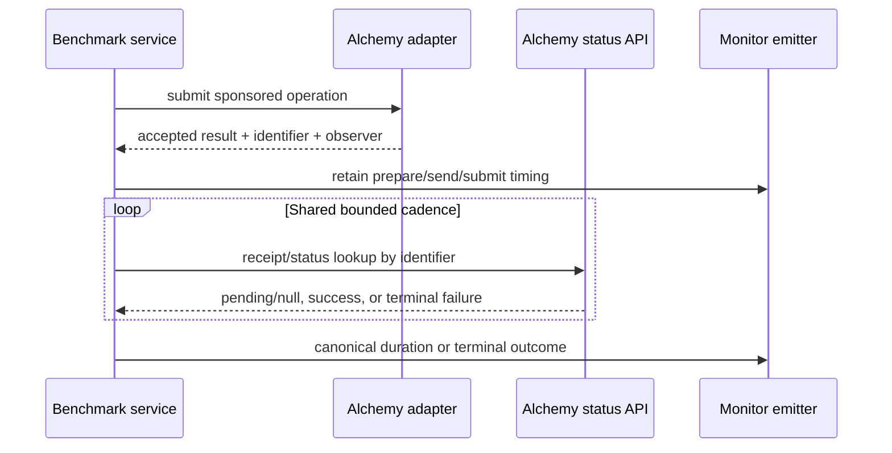
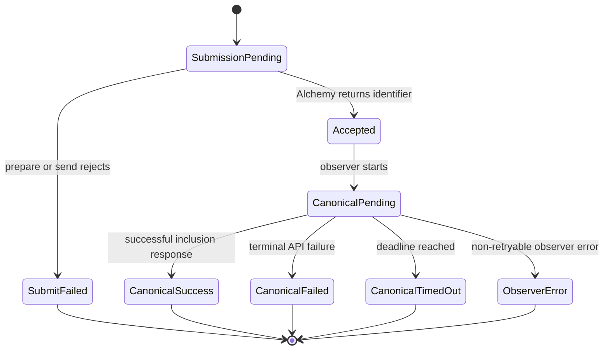
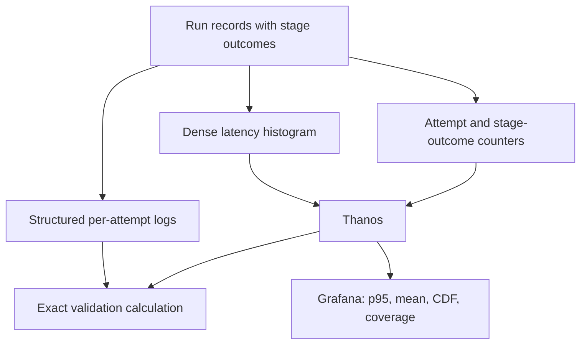

# Canonical Latency Measurement Integrity - Plan

**Target repositories:** `tx-bench` owns benchmark execution and metric emission; `alchemy-benchmarking` owns the Grafana dashboard artifact. Paths are repo-relative within the repository named by each implementation unit.

## Goal Capsule

- **Objective:** Make the internal BSO and Wallet SendCalls canonical-latency numbers accurate, auditable, and comparable as Alchemy-observed benchmarks.
- **Authority:** The session-settled measurement decisions in this plan override the legacy gauge and neutral-observer assumptions in the origin requirements; official ERC-4337, EIP-5792, and Alchemy API contracts govern observer behavior.
- **Execution profile:** Deep, cross-repository correction spanning adapter lifecycle, status polling, Prometheus schema, dashboard semantics, and production validation.
- **Stop conditions:** Do not ship if the monitor can use a non-Alchemy observer, either adapter infers canonical status from logs, or a downstream canonical failure erases an accepted submission timing.
- **Tail ownership:** Land producer changes before the dashboard cutover, then validate the new measurement epoch against structured attempt logs and live Thanos data.

---

## Product Contract

### Summary

The internal monitor will measure canonical latency through Alchemy's standard status APIs: `eth_getUserOperationReceipt` for BSO and `wallet_getCallsStatus` for Wallet SendCalls. It will expose a new dense-bucket measurement epoch immediately, preserve partial-success timings, and make observation coverage and failure outcomes visible beside latency.

### Problem Frame

The July histogram cutover made windowed percentiles composable but left canonical buckets at 2, 4, and 8 seconds. In the trailing 24-hour production data inspected on 2026-07-20, this forced BSO p95 into either the 2–4 second or 4–8 second interpolation band and made Wallet p99 converge near 4 seconds across every region. Those outputs look precise but mostly describe bucket geometry.

The two paths also use different lifecycle semantics. BSO scans EntryPoint logs through a generic canonical oracle, while Wallet waits inside submission for a provider result. If Wallet status polling rejects after `wallet_sendPreparedCalls` succeeds, the service records a submit failure and discards valid prepare, send, and acceptance timings. The dashboard then labels successful histogram observations as attempts, hiding this censoring.

The origin requirements remain authoritative about the product goal: hourly, Alchemy-only internal regression monitoring in Grafana. Their gauge-based percentile design and neutral-observer assumptions were superseded by the July histogram work and the decisions recorded here.

### Requirements

**Alchemy observation contract**

- R1. Every observer used by the continuous internal monitor must call an Alchemy-owned endpoint derived from the configured network and Alchemy API key.
- R2. BSO canonical status must poll `eth_getUserOperationReceipt` with the exact hash returned by `eth_sendUserOperation` and mined/latest semantics; it must not use a preconfirmed result or scan EntryPoint logs.
- R3. Wallet canonical status must poll `wallet_getCallsStatus` with the exact call ID returned by `wallet_sendPreparedCalls`; it must not infer status from receipts, logs, or transaction events.
- R4. Both observers must use the same bounded polling cadence and timeout policy so adapter comparisons do not mostly reflect different client defaults.
- R5. A canonical success is the first successful API response showing inclusion: a non-null BSO receipt with `success: true`, or Wallet status `200`.

**Attempt lifecycle and auditability**

- R6. A successful submission must preserve its prepare, send, submit, identifier, and acceptance timestamp even when canonical polling later fails, times out, or returns a terminal failure.
- R7. Every expected stage must emit one bounded outcome classification per attempt, while latency histograms include only stages with a valid successful duration.
- R8. Structured per-attempt logs must record stage durations, outcomes, observer API, poll count, terminal status or error class, network, region, provider, and run index without emitting credentials or private keys.
- R9. Attempt failure, canonical failure, timeout, observer error, and missing observation must remain distinguishable in metrics and logs.

**Metric and dashboard integrity**

- R10. The monitor must cut directly to a new measurement epoch with denser classic histogram buckets and no dual-emission warm-up.
- R11. Canonical bucket widths must be at most 250 ms from 1–4 seconds and at most 500 ms from 4–8 seconds, while retaining coverage for faster stages and tails through 120 seconds.
- R12. Dashboard queries must select only the new measurement epoch so a range crossing deployment cannot blend incompatible bucket populations.
- R13. Canonical panels must show p95, arithmetic mean, successful observations, observation coverage, and threshold CDFs at 2 and 4 seconds.
- R14. The dashboard must call histogram counts “successful observations,” never “attempts” or “samples,” and show total attempts separately.
- R15. Canonical p99 must be absent from the default view and may appear only when the selected population contains at least 1,000 successful observations.

### Success Metrics

- Every production attempt has exactly one submit outcome and one canonical outcome in the new measurement epoch.
- For each provider, network, and region, canonical successful observations plus terminal non-success outcomes reconcile to attempts over the same window.
- No new canonical p95 estimate is interpolated across a bucket wider than the R11 bounds in the expected 1–8 second range.
- Mean derived from histogram `_sum / _count` matches the mean computed from structured successful-attempt logs within 1% over a fixed validation window.
- Histogram p95 falls within the bucket that contains the exact log-derived p95 over the same attempts.
- Production queries show only Alchemy observer APIs for BSO and Wallet canonical stages.
- The post-cutover validation window has no rate-limit responses and no unexplained observer-error outcomes.

### Scope Boundaries

**In scope**

- The continuous monitor's two active adapters: `alchemy-mav2-bso` and `alchemy-wallet-sendcalls`.
- Adapter-owned standard status observers, benchmark result lifecycle, stage aggregation, Prometheus emission, structured logging, and the supplied Grafana dashboard.
- Removal of monitor-only neutral RPC overrides that could redirect internal canonical measurements away from Alchemy.

**Outside this correction**

- The public benchmark page, competitor-provider behavior, and generic CLI support for a neutral fallback observer.
- Native Prometheus histograms, changes to Alloy remote-write configuration, new alerts, and benchmark scheduling or gas-budget changes.
- Reinterpreting historical series produced before the new measurement epoch.

#### Deferred to Follow-Up Work

- Remove the generic log-scanning canonical oracle only after no CLI or competitor workflow uses it.
- Add a dedicated long-window p99 panel if production usage shows that ranges regularly exceed the 1,000-observation gate.
- Move the Grafana artifact if the untracked `grafana/` directory in `alchemy-benchmarking` is not its canonical version-controlled home; the supplied JSON remains the source for this correction until ownership is resolved.

### Acceptance Examples

- AE1. Given a BSO submission returns a user operation hash and `eth_getUserOperationReceipt` returns `null`, then a successful receipt, the attempt preserves submit timing and records canonical latency at the first successful receipt response.
- AE2. Given a BSO receipt is returned with `success: false`, the attempt keeps submit timing, records a failed canonical outcome, and adds no successful canonical histogram observation.
- AE3. Given Wallet status progresses from `100` to `200`, the attempt preserves prepare, send, and submit timings and records canonical latency at the first `200` response.
- AE4. Given Wallet status returns `400`, `500`, or `600`, the attempt keeps accepted-stage timings, records the corresponding terminal canonical failure, and adds no successful canonical histogram observation.
- AE5. Given either status API times out or throws after submission, the attempt remains submission-successful and records a canonical timeout or observer error with zero canonical latency observations.
- AE6. Given a dashboard range crosses the deployment, new queries include only the new measurement epoch and do not combine old and new bucket schemas.
- AE7. Given fewer than 1,000 successful canonical observations, the default dashboard provides no p99 value while p95, mean, CDFs, outcomes, and coverage remain visible.

---

## Planning Contract

### Key Technical Decisions

- KTD1. **All continuous-monitor measurements use Alchemy endpoints.** The monitor derives network RPC and Wallet API transports from the Alchemy API key and rejects non-Alchemy overrides. (session-settled: user-directed — chosen over neutral or public observers: the benchmark exists to track Alchemy's internal paths)
- KTD2. **BSO canonical observation uses `eth_getUserOperationReceipt`.** The adapter polls the standard Bundler API by submitted user operation hash with mined/latest semantics and treats a successful structured receipt as canonical inclusion. Preconfirmed responses do not satisfy canonical. (session-settled: user-directed — chosen over EntryPoint log scanning: the standard API owns receipt discovery and decoding)
- KTD3. **Wallet canonical observation uses raw `wallet_getCallsStatus` responses.** The installed Viem action normalizes numeric statuses to strings, so the adapter issues the standard JSON-RPC method through the existing Alchemy transport and preserves the EIP-5792 status family. Receipts are evidence returned by the API, not input to custom status inference. (session-settled: user-directed — chosen over receipt or event parsing: the de facto Wallet API defines the transaction lifecycle)
- KTD4. **Adapters return an accepted result before observing canonical status.** The benchmark service owns the post-acceptance wait and converts terminal results or observer errors into stage outcomes without rewriting submission history.
- KTD5. **Adapter-owned observers take precedence; the generic canonical oracle is fallback-only.** Alchemy BSO and Wallet clients expose their status observer capability, while providers without one may continue using the existing injected oracle outside the monitor. (session-settled: user-approved — chosen over changing every CLI provider: the confirmed scope is the internal monitor)
- KTD6. **Both status APIs share one bounded polling schedule and the existing canonical timeout.** Poll every 250 ms through the expected 1–8 second canonical range, then back off to a maximum 2-second interval for both adapters. This keeps ordinary observations comparable while bounding calls during a stuck or failing attempt.
- KTD7. **The cutover is immediate but epoch-isolated.** Add a bounded measurement-epoch label to latency, attempt, and outcome series; deploy one emitter schema and switch dashboard queries in the same release window without dual emission. (session-settled: user-directed — chosen over dual emission and warm-up: no consumer depends on the current metric schema)
- KTD8. **Stage outcomes are first-class counters.** A bounded `stage` and `outcome` label set replaces inference from missing histograms; successful latency remains in the histogram and attempt count remains a separate counter.
- KTD9. **Canonical p99 is reliability-gated.** The default view omits it and any future query requires at least 1,000 successful observations. (session-settled: user-approved — chosen over always displaying p99: the current low-volume p99 is dominated by quantization and tail sparsity)

### High-Level Technical Design

#### Adapter status sequences

For BSO the identifier is the user operation hash and the lookup is `eth_getUserOperationReceipt`. For Wallet the identifier is the call ID and the lookup is `wallet_getCallsStatus`.

#### Attempt state model

Accepted-stage timings survive every branch after `Accepted`. Only `CanonicalSuccess` contributes a canonical latency observation; all terminal branches contribute a canonical outcome.

#### Measurement flow

### Sequencing

1. Establish the accepted-result and adapter-observer contract before changing either adapter.
2. Implement and test BSO and Wallet status observers against the shared lifecycle.
3. Cut monitor metrics, logs, and neutral configuration to the new epoch after both adapters produce complete outcomes.
4. Update the Grafana artifact and deploy it with the producer release; treat the deployment timestamp as the start of valid history.
5. Validate one fixed window in Thanos against structured logs before using the dashboard for regression decisions.

### Operational Cutover and Rollback

**Pre-cutover gates**

- Confirm the supplied dashboard's version-controlled owner and save the current production dashboard revision.
- Record the deployment timestamp and the chosen measurement-epoch value before the producer deploy.
- Confirm staging exposition contains the dense bucket set, attempts, and exactly one canonical outcome per attempt for both providers.
- Confirm structured logs expose observer API, poll count, terminal status, and redacted errors.

**Cutover**

1. Deploy the new producer schema and confirm all configured regions and both providers emit the new epoch.
2. Switch the dashboard to epoch-filtered queries in the same release window.
3. Treat data before the recorded timestamp as a separate historical epoch.
4. Hold dashboard sign-off until the first complete hourly run reconciles; use a longer fixed window for the mean and p95 accuracy gates.

**Stop or rollback**

- Stop if any active monitor calls a non-Alchemy URL, either canonical API is absent, outcomes do not reconcile, or rate limiting creates observer errors.
- Roll back producer and dashboard together. Restore the saved dashboard revision, mark the cutover interval invalid, and never merge the failed epoch with either the old or replacement epoch.
- Because the cutover has no dual emission, rollback restores service but does not preserve a continuous percentile history; this is accepted by KTD7.

### System-Wide Impact

- **Benchmark semantics:** `error` no longer conflates submission failure with a downstream canonical observation failure.
- **Configuration:** Internal monitoring stops accepting neutral RPC maps for canonical observation; CLI configuration remains unchanged.
- **Metrics cardinality:** Dense buckets and bounded `measurement_epoch`, `observer_api`, and `outcome` labels add series, but the active provider, stage, network, and region sets are small and fixed.
- **Operations:** `wallet_getCallsStatus` and `eth_getUserOperationReceipt` each cost Alchemy compute units per poll; the shared cadence must be checked for throttling during rollout.
- **Dashboard ownership:** The supplied dashboard is currently untracked in `alchemy-benchmarking`, so implementation must establish a version-controlled landing location before declaring the dashboard unit complete.

### Risks and Dependencies

| Risk or dependency | Impact | Mitigation |
|---|---|---|
| Status polling cadence dominates measured latency | Provider comparison reflects client defaults instead of backend behavior | Use one 250 ms schedule through 8 seconds and the same capped backoff thereafter |
| Status polling is throttled | Observer errors or delayed responses inflate results | Record poll count and error class, cap post-8-second polling, and block sign-off on rate-limit responses |
| Dashboard range crosses the cutover | Incompatible bucket histories produce false quantiles | Require the new measurement epoch label in every latency, count, and outcome query |
| SDK helpers normalize away standard status detail | Failure families become indistinguishable | Poll the SDK's direct status action or raw standard RPC while preserving numeric status classes |
| A downstream failure still throws through the submission boundary | Valid prepare/send/submit data remains censored | Characterize partial-success behavior before refactoring the lifecycle and assert it at service and monitor layers |
| Grafana JSON is not a tracked deployment source | Dashboard changes can be lost or diverge from production | Confirm ownership and commit/import the supplied artifact as part of the dashboard unit |

### Sources and Research

- Legacy product goal and operational boundaries: `docs/brainstorms/2026-06-29-continuous-monitoring-requirements.md`.
- Histogram cutover and its original coarse-bucket assumption: `docs/plans/2026-07-17-latency-histogram-emission-spec.md`.
- Existing lifecycle and fallback oracle: `src/benchmark/service.ts`, `src/benchmark/metrics.ts`, and `src/benchmark/oracle/canonical.ts`.
- Current monitor emission and bucket schema: `src/monitor/loop.ts` and `src/monitor/metrics.ts`.
- Official ERC-4337 method contract: [EIP-4337](https://eips.ethereum.org/EIPS/eip-4337) and [Alchemy `eth_getUserOperationReceipt`](https://www.alchemy.com/docs/wallets/api-reference/bundler-api/bundler-api-endpoints/eth-get-user-operation-receipt).
- Official Wallet call-status contract: [EIP-5792](https://eips.ethereum.org/EIPS/eip-5792) and [Alchemy `wallet_getCallsStatus`](https://www.alchemy.com/docs/wallets/api-reference/smart-wallets/wallet-api-endpoints/wallet-api-endpoints/wallet-get-calls-status).
- Live Thanos evidence collected on 2026-07-20 is summarized in the Appendix.

---

## Implementation Units

### U1. Preserve accepted submissions through canonical observation

- **Goal:** Separate accepted submission state from canonical observer state so downstream failures cannot erase valid stage timings.
- **Requirements:** R4–R9; KTD4, KTD5, KTD8.
- **Dependencies:** None.
- **Files** (`tx-bench`):
  - `src/benchmark/providers/types.ts`
  - `src/benchmark/contracts.ts`
  - `src/benchmark/service.ts`
  - `src/benchmark/metrics.ts`
  - `src/benchmark/aggregate.ts`
  - `src/benchmark/service.test.ts`
  - `src/benchmark/metrics.test.ts`
  - `src/benchmark/aggregate.test.ts`
- **Approach:** Introduce an adapter-owned canonical observer capability that is known before submission and invoked only after an accepted result returns. Keep the generic canonical oracle as an optional fallback for clients without this capability. Represent submission and canonical failures independently, preserve the accepted identifier and timestamp, and aggregate each successful stage without requiring the whole attempt to be globally successful.
- **Execution note:** Add characterization coverage for the current throw-after-acceptance behavior before changing the result lifecycle.
- **Patterns to follow:** Existing injectable oracle interfaces in `src/benchmark/oracle/canonical.ts`, `StageStatus` normalization in `src/benchmark/contracts.ts`, and error redaction in `src/benchmark/serialize.ts`. Extend redaction to the Alchemy API key and keyed endpoint URLs before observer errors reach records or logs.
- **Test scenarios:**
  1. An adapter without an owned observer uses the fallback oracle and preserves existing successful behavior.
  2. An adapter-owned observer skips the fallback oracle's pre-submit block lookup and watch calls.
  3. Submission rejection creates a failed submit stage, no accepted identifier, and a not-observed canonical stage.
  4. Submission acceptance followed by observer timeout keeps submit latency and records canonical timed-out.
  5. Submission acceptance followed by observer rejection keeps submit latency and records observer-error without leaking the owner private key, Alchemy API key, or keyed endpoint URL.
  6. Stage aggregation includes successful prepare, send, and submit durations from a record whose canonical stage failed.
  7. Each attempt produces exactly one normalized outcome for every expected stage.
- **Verification:** Service and aggregation tests prove the lifecycle matrix, and type checking shows every adapter satisfies the revised contract.

### U2. Observe BSO through the standard Bundler receipt API

- **Goal:** Make `alchemy-mav2-bso` canonical timing poll Alchemy's structured UserOperation receipt API by submitted hash.
- **Requirements:** R1, R2, R4–R6, R9; Covers AE1, AE2; KTD1, KTD2, KTD6.
- **Dependencies:** U1.
- **Files** (`tx-bench`):
  - `src/benchmark/providers/alchemy-mav2-bso.ts`
  - `src/benchmark/providers/alchemy-mav2-bso.test.ts`
- **Approach:** Reuse the adapter's Alchemy Bundler transport to expose a canonical observer that polls `eth_getUserOperationReceipt` with the exact returned user operation hash. Treat `null` as pending, a receipt with `success: true` as canonical success, and a receipt with `success: false` as terminal failure. Read block and transaction identifiers from the structured receipt without decoding logs.
- **Patterns to follow:** The adapter's existing `createBundlerClient` and `alchemyTransport` construction, network resolution, dependency injection, and stable-owner tests.
- **Test scenarios:**
  1. Covers AE1. Two `null` responses followed by a successful mined receipt produce one canonical success with the receipt's block and transaction identifiers.
  2. Covers AE2. A receipt with `success: false` produces a failed canonical stage and retains the submit stage.
  3. The observer receives the exact hash returned by `sendUserOperation` and never calls a log or transaction parsing helper.
  4. A preconfirmed result remains pending and does not satisfy the canonical stage.
  5. A retryable request error is retried within the shared deadline; a terminal or exhausted error becomes observer-error.
  6. The adapter uses an Alchemy transport for every receipt poll across each supported monitoring network.
  7. The shared timeout produces timed-out without converting the attempt into submit-failed.
- **Verification:** Adapter tests prove API selection, hash identity, status mapping, Alchemy transport ownership, cadence, and timeout behavior.

### U3. Observe Wallet through the standard call-status API

- **Goal:** Make `alchemy-wallet-sendcalls` return immediately after acceptance and poll Alchemy's EIP-5792 status API by call ID.
- **Requirements:** R1, R3–R9; Covers AE3–AE5; KTD1, KTD3, KTD4, KTD6.
- **Dependencies:** U1.
- **Files** (`tx-bench`):
  - `src/benchmark/providers/alchemy-wallet-sendcalls.ts`
  - `src/benchmark/providers/alchemy-wallet-sendcalls.test.ts`
- **Approach:** End the timed submission operation after `wallet_sendPreparedCalls` returns the call ID. Expose a separate observer that sends the raw `wallet_getCallsStatus` JSON-RPC method through the existing Alchemy transport because Viem's helper normalizes away numeric status families. Map 1xx to pending, 200 to success, and 4xx/5xx/6xx to bounded terminal outcomes; preserve the receipt only as structured evidence. Do not use receipt contents or events to decide the status.
- **Patterns to follow:** Existing prepare/sign/send timing decomposition, Alchemy Wallet transport creation, stable-owner behavior, and dependency-injected client tests.
- **Test scenarios:**
  1. `sendSponsored` returns after `sendPreparedCalls` and does not wait for canonical status.
  2. Covers AE3. Status `100` followed by `200` records canonical success while preserving prepare, send, and submit timings.
  3. Covers AE4. Status `400`, `500`, and `600` each produce a bounded terminal canonical failure without changing submit success.
  4. Covers AE5. Poll timeout and request rejection retain accepted-stage timings and map to timed-out or observer-error.
  5. The observer passes the exact call ID returned by `sendPreparedCalls` to every status request.
  6. Status is never inferred from a receipt's transaction status, logs, or topics.
  7. Every Wallet API call uses `alchemyWalletTransport` and the Alchemy API endpoint.
- **Verification:** Adapter tests enforce the EIP-5792 state mapping, call-ID continuity, stage preservation, and absence of custom parsing.

### U4. Emit a dense, auditable measurement epoch

- **Goal:** Replace coarse and censoring-prone monitor metrics with an epoch-isolated histogram, attempt counter, stage outcomes, and exact audit logs.
- **Requirements:** R1, R4, R7–R12, R14; Covers AE5, AE6; KTD6–KTD8.
- **Dependencies:** U1, U2, U3.
- **Files** (`tx-bench`):
  - `src/monitor/metrics.ts`
  - `src/monitor/metrics.test.ts`
  - `src/monitor/loop.ts`
  - `src/monitor/loop.test.ts`
  - `src/monitor/secrets.ts`
  - `src/monitor/secrets.test.ts`
- **Approach:** Replace the canonical bucket gaps with a layout satisfying R11 and add bounded epoch and observer provenance to relevant series. Emit one stage outcome per expected stage and observe every successful stage independently of later failures. Log one redacted structured event per attempt containing stage timing and outcome data. Remove monitor use of neutral RPC secrets and construct only Alchemy transports for the two active adapters.
- **Execution note:** Implement synthetic boundary and reconciliation tests before changing the dashboard consumer.
- **Patterns to follow:** Existing `buildMetrics` custom-registry factory, `emitRunMetrics` counter emission, structured `provider_summary` and `run_failed` logging, and secret parsing tests.
- **Test scenarios:**
  1. The bucket layout covers 5 ms through 120 seconds and satisfies both maximum-width constraints in R11.
  2. A known synthetic distribution's exact p95 lies inside the histogram bucket used for its estimated p95.
  3. A canonical success increments histogram count and the successful canonical outcome once.
  4. A canonical failure, timeout, or observer error increments its outcome once and does not increment canonical histogram count.
  5. A record with successful prepare/send/submit and failed canonical observes the three valid durations.
  6. Attempts equal the sum of terminal canonical outcomes for a complete synthetic run.
  7. Every emitted series includes the new measurement epoch and bounded observer provenance where applicable.
  8. Structured attempt logs contain durations, outcomes, poll count, and terminal status or error class but redact prefixed and bare owner private keys, the Alchemy API key, and any keyed endpoint URL.
  9. Monitor configuration ignores or rejects `NEUTRAL_RPC_URL` and `NEUTRAL_RPC_URLS` instead of routing internal observations through them.
- **Verification:** Monitor tests prove bucket resolution, cardinality labels, reconciliation, partial-success emission, redaction, and Alchemy-only configuration.

### U5. Make the Grafana dashboard honest about precision and coverage

- **Goal:** Cut the supplied dashboard to the new epoch and present canonical latency with its population, resolution, and outcomes.
- **Requirements:** R12–R15; Covers AE6, AE7; KTD7–KTD9.
- **Dependencies:** U4.
- **Files** (`alchemy-benchmarking`):
  - `grafana/dashboards/txe-write-bench-v3.json`
- **Approach:** Filter every monitor query to the new measurement epoch. Replace canonical p50/p90/p95/p99 tables with p95, histogram mean, CDF-at-2-seconds, CDF-at-4-seconds, successful observations, total attempts, and coverage. Add an outcome breakdown and state the Alchemy observer API used by each provider. Remove default p99 and correct every description or legend that equates histogram observations with attempts.
- **Patterns to follow:** Existing range-pooled `histogram_quantile`, `_sum`, `_count`, and counter `increase` queries; existing region pivots and provider sections in the supplied dashboard.
- **Test expectation:** No repository-native dashboard test harness exists. Validate JSON structure, importability, query label consistency, and live results through the Verification Contract.
- **Verification:** The dashboard imports without migration errors, every panel selects the new epoch, and live Thanos results reconcile with U4's structured logs over one fixed post-cutover window.

---

## Verification Contract

| Gate | Repository | Applies to | Required outcome |
|---|---|---|---|
| `bun test src/benchmark/service.test.ts src/benchmark/metrics.test.ts src/benchmark/aggregate.test.ts` | `tx-bench` | U1 | Accepted-stage lifecycle and independent aggregation scenarios pass |
| `bun test src/benchmark/providers/alchemy-mav2-bso.test.ts src/benchmark/providers/alchemy-wallet-sendcalls.test.ts` | `tx-bench` | U2, U3 | Standard API, identifier continuity, terminal outcomes, and Alchemy transport tests pass |
| `bun test src/monitor/metrics.test.ts src/monitor/loop.test.ts src/monitor/secrets.test.ts` | `tx-bench` | U4 | Bucket, reconciliation, logging, and monitor configuration tests pass |
| `bunx tsc --noEmit` | `tx-bench` | U1–U4 | Revised observer and result contracts type-check across every adapter and caller |
| `jq empty grafana/dashboards/txe-write-bench-v3.json` | `alchemy-benchmarking` | U5 | Dashboard remains valid JSON before import |
| Grafana import and query inspection | `alchemy-benchmarking` | U5 | Every latency, count, outcome, and coverage query filters the new epoch and uses compatible labels |
| Fixed-window Thanos/log reconciliation | Production | U4, U5 | Attempts reconcile to outcomes; mean differs by at most 1%; p95 lies inside the exact p95 bucket |
| Endpoint provenance audit | Production | U2–U5 | BSO uses only `eth_getUserOperationReceipt`; Wallet uses only `wallet_getCallsStatus`; both target Alchemy URLs |
| Observer load audit | Production | U2–U5 | Poll counts follow the shared schedule; no rate-limit response or unexplained observer error appears in the validation window |

Production validation must use a window beginning after the deployment timestamp. A failed reconciliation, missing region, unexpected observer API, or rate-limit-driven observer error blocks dashboard sign-off.

---

## Definition of Done

**Global**

- All R1–R15 requirements and AE1–AE7 examples are satisfied.
- Both repositories contain only intentional changes; the dashboard has a confirmed version-controlled home.
- All Verification Contract gates pass, including one post-cutover production reconciliation window.
- No monitor configuration can redirect either active adapter's canonical observer away from Alchemy.
- Abandoned observer, dual-emission, parsing, or bucket experiments are removed from the final diff.

**Per unit**

- U1 is done when submission and canonical outcomes are independent and all adapters compile against the revised contract.
- U2 is done when BSO canonical status is derived only from structured Alchemy UserOperation receipts.
- U3 is done when Wallet canonical status is derived only from structured Alchemy call-status codes.
- U4 is done when dense epoch-isolated metrics, stage outcomes, audit logs, and reconciliation tests pass.
- U5 is done when the imported dashboard exposes p95, mean, CDFs, observations, attempts, coverage, and outcomes without default p99 or pre-cutover blending.

---

## Appendix

### Production evidence from 2026-07-20

The trailing 24-hour Thanos window for `prod` / `base-mainnet` contained 480 attempts per provider and region, matching 20 attempts per hourly run. There was no evidence of unit conversion or duplicate ingestion.

| Provider | Region | Histogram p95 | Histogram mean | Quantile bucket | Successful canonical observations |
|---|---:|---:|---:|---:|---:|
| BSO | `ap-southeast-1` | 3.90 s | 2.36 s | 2–4 s | 480 / 480 |
| BSO | `eu-central-1` | 6.31 s | 2.57 s | 4–8 s | 480 / 480 |
| BSO | `us-east-1` | 5.42 s | 2.11 s | 4–8 s | 480 / 480 |
| BSO | `us-west-2` | 6.12 s | 2.58 s | 4–8 s | 480 / 480 |
| Wallet | `ap-southeast-1` | 3.86 s | 2.56 s | 2–4 s | 431 / 480 |
| Wallet | `eu-central-1` | 3.86 s | 2.39 s | 2–4 s | 420 / 480 |
| Wallet | `us-east-1` | 3.86 s | 1.98 s | 2–4 s | 434 / 480 |
| Wallet | `us-west-2` | 3.85 s | 2.43 s | 2–4 s | 414 / 480 |

Wallet p99 ranged only from 3.97–3.98 seconds across regions. Missing Wallet canonical observations exactly matched the corresponding failure counts of 49, 60, 46, and 66, which is consistent with lifecycle censoring rather than a separate sample-count problem.
